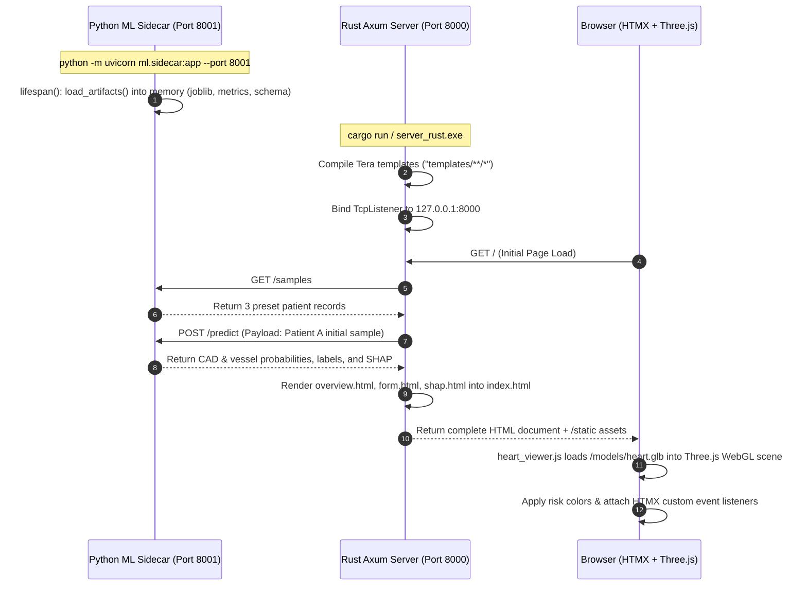
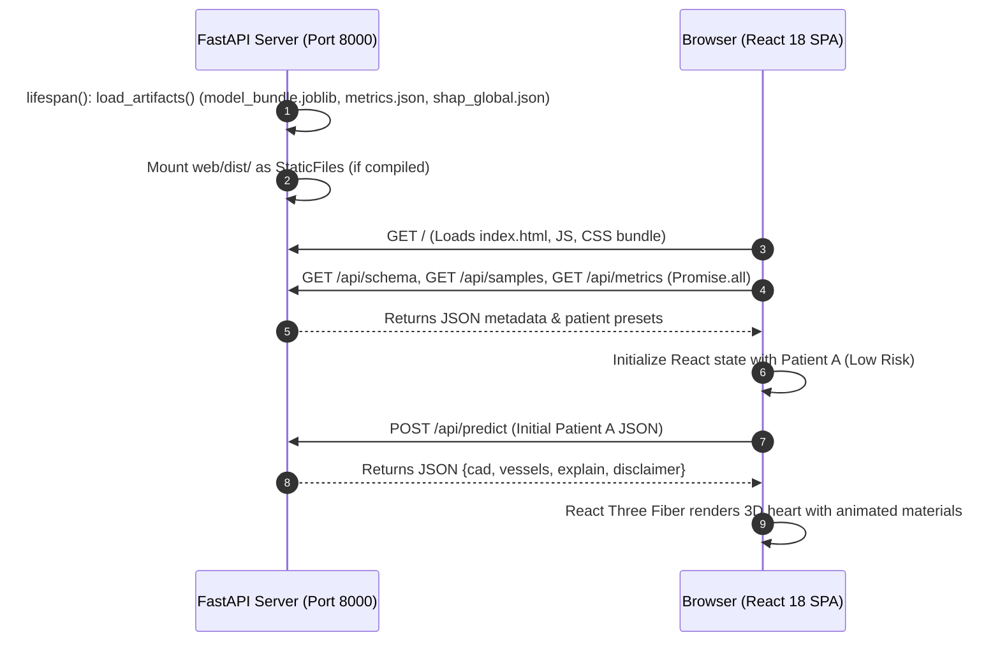
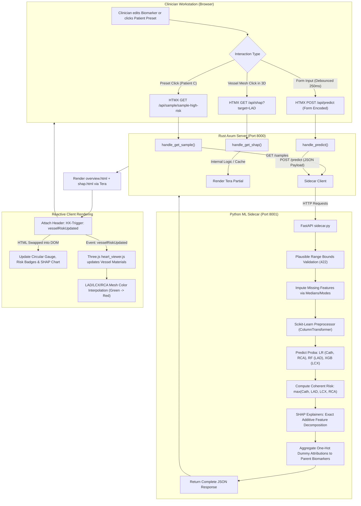
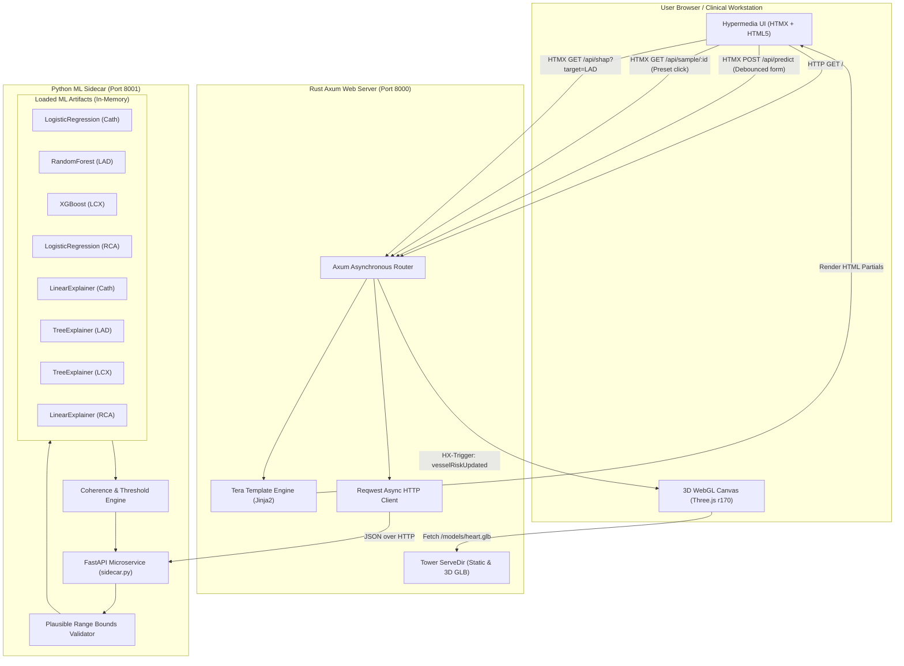
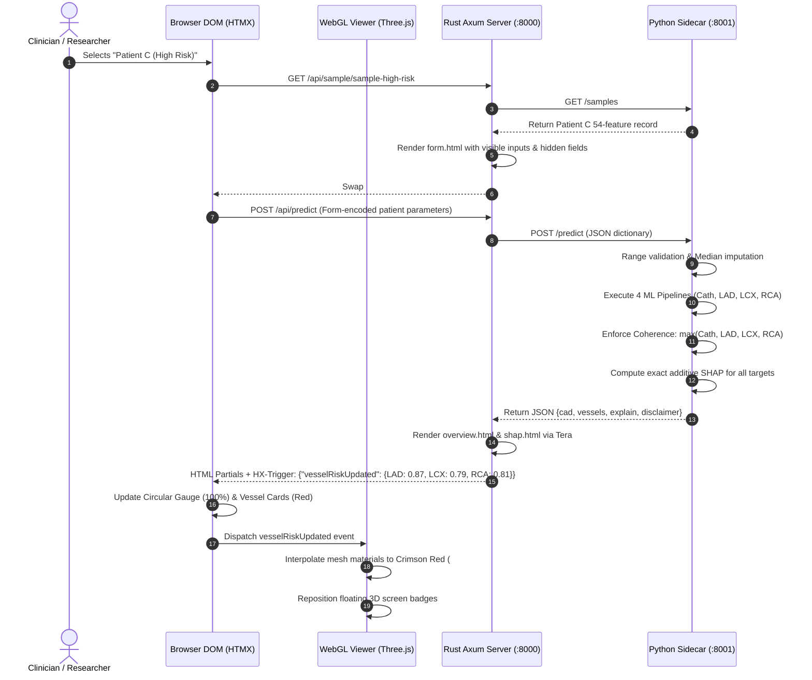
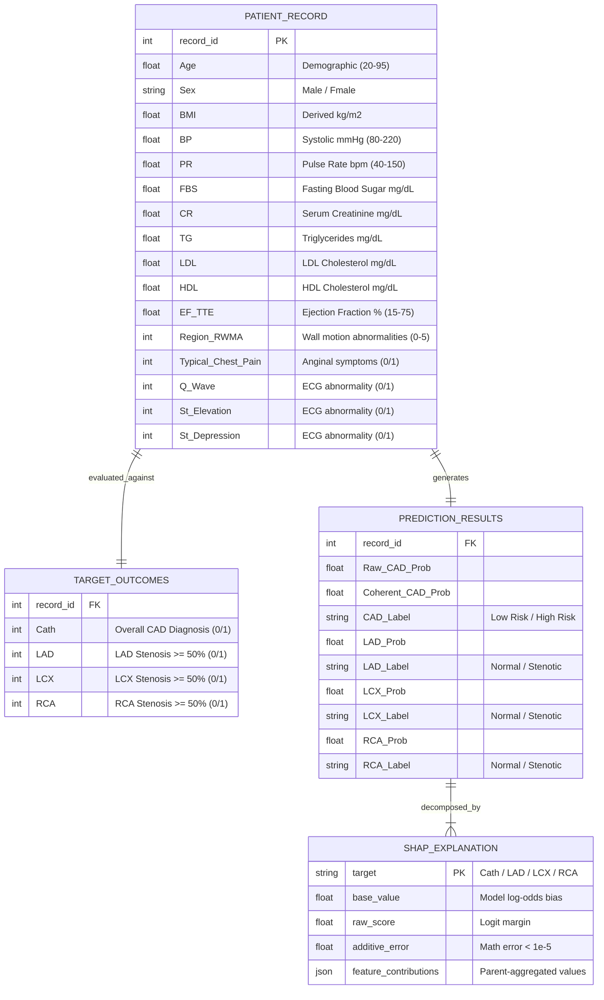

# Cardio3D AI: System Architecture & Technical Specifications

---

## 1. PROJECT OVERVIEW

### Core Purpose
**Cardio3D AI** is a multimodal clinical decision-support and educational visualization platform for coronary artery disease (CAD) assessment. Given 54 patient demographic, symptom, examination, ECG, echocardiographic, and laboratory biomarkers, the system concurrently predicts overall CAD status alongside vessel-specific stenosis ($\ge 50\%$ diameter reduction) across the three primary coronary arteries: the Left Anterior Descending (**LAD**), the Left Circumflex (**LCX**), and the Right Coronary Artery (**RCA**). Predictions are coupled with exact additive local feature attributions via SHAP (SHapley Additive exPlanations) and mapped dynamically onto an interactive, GPU-accelerated 3D anatomical coronary heart model derived from BodyParts3D meshes.

### Technology Stack
- **Primary Languages**:
  - **Python 3.14.5**: Core ML pipelines, training, SHAP explainers, dataset ingestion, and IPC sidecar microservice.
  - **Rust (2021 edition)**: High-concurrency, sub-millisecond asynchronous Axum web server and hypermedia router.
  - **TypeScript 5.7 / JavaScript (ES2022)**: Browser interaction layers, WebGL 3D rendering, and client component logic.
  - **HTML5 & CSS3**: Modern dark glassmorphic medical workstation design system.
- **Machine Learning & Data Processing**:
  - `scikit-learn 1.6+`: Data transformers, Pipelines, LogisticRegression, RandomForest, cross-validation metrics.
  - `xgboost 2.0+`: Gradient-boosted decision trees for non-linear vessel stenosis estimation.
  - `shap 0.45+`: `LinearExplainer` and `TreeExplainer` providing mathematically exact additive attribution ($| \text{error} | < 10^{-5}$).
  - `pandas 2.2+` & `numpy 1.26+`: Tabular feature wrangling and matrix operations.
  - `joblib 1.4+`: Zero-copy artifact serialization and deserialization.
  - `trimesh 4.0+`: 3D OBJ parsing, coordinate centering, node classification, and binary GLB compilation.
- **Web Engines & Backends**:
  - **Rust Backend**: `axum 0.7`, `tokio 1.0` (asynchronous runtime), `tower-http 0.5`, `tera 1.19` (Jinja2-compatible templating), `reqwest 0.12`.
  - **Python Backend**: `fastapi 0.110+`, `uvicorn 0.28+`, `pydantic 2.6+`, `starlette 0.36+`.
  - **Hypermedia / Client**: `HTMX 2.0` (reactive AJAX partial swapping and event-driven trigger dispatch).
  - **3D Graphics**: `Three.js 0.170` (Vanilla WebGL 3D viewer) and React Three Fiber / Drei (`@react-three/fiber 8.17`, `@react-three/drei 9.120`).
  - **React SPA**: `React 18.3`, `Vite 6.2`, `Tailwind CSS 3.4`, `Lucide React 0.475`.
- **Runtime Versions**:
  - Python: 3.14.5 (x86_64 Windows)
  - Rust: rustc 1.84.0 / Cargo 1.84.0
  - Node.js: v20+ / npm 10+

### Project Type
Cardio3D AI is an **enterprise-grade multimodal clinical workstation and ML inference monorepo**. It contains two interoperable architectures:
1. **High-Performance Rust Workstation**: Rust (Axum) web server + HTMX reactive partial swapping + Vanilla Three.js + Python ML IPC sidecar (listening on port 8000).
2. **Full-Stack Python/React Application**: FastAPI unified server + React SPA bundle + React Three Fiber (compiled into `web/dist/`).

---

## 2. FULL DIRECTORY TREE

Below is the complete inventory of all files and folders in the repository (excluding generated build artifacts, virtual environments, and `.git`):

```text
CAD/
│
├── .gitignore                                         # Git ignore specifications for Python, Node, OS, and build artifacts
├── CLAUDE.md                                          # Development invariants, coding rules, and zero-leakage constraints
├── Makefile                                           # Orchestration tasks: setup, local/colab training, testing, 3D builds, serving
├── PLAN.md                                            # Technical specifications, assumptions, and architectural roadmap
├── README.md                                          # Project overview, quickstart instructions, evaluation tables, and citations
│
├── 3D MODAL/                                          # Original source directory for raw 3D anatomical meshes
│   └── BP51782_FMA3_2_1_inference_isa_FMA67135_Postnatal_anatomical_structure/ # 129 BodyParts3D OBJ polygon mesh files
│       ├── MM500_BP51860_FMA7096_Right_ventricle.obj   # Mesh: Right ventricle chamber and muscular walls
│       ├── MM502_BP51846_FMA7097_Left_ventricle.obj    # Mesh: Left ventricle thick myocardium shell
│       ├── MM513_BP51924_FMA3900_Anterior_interventricular_branch.obj # Mesh: Trunk of Left Anterior Descending (LAD) artery
│       ├── MM635_BP51973_FMA74923_Trunk_circumflex_branch.obj # Mesh: Trunk of Left Circumflex (LCX) coronary artery
│       ├── MM545_BP51923_FMA3901_Right_coronary_artery.obj # Mesh: Trunk of Right Coronary Artery (RCA)
│       └── ... (124 additional anatomical mesh files representing valves, chambers, septa, and cardiac vessels)
│
├── DATASET/                                           # Original external dataset storage
│   └── extention of Z-Alizadeh sani dataset.xlsx      # Raw Excel dataset from UCI ML Repository (303 rows, 54 features, 4 targets)
│
├── api/                                               # FastAPI monolithic REST API and web application server
│   ├── main.py                                        # FastAPI app serving /api routes, validating inputs, and serving static SPA
│   └── tests/                                         # API integration test suite
│       └── test_api.py                                # Pytest validating schema, metrics, samples, predict contract, HTTP 422, p95 latency
│
├── data/                                              # Structured project data directory
│   └── raw/                                           # Canonical raw immutable inputs
│       ├── CHECKSUMS                                  # SHA256 integrity hashes for dataset and all 129 BodyParts3D OBJ files
│       ├── extention of Z-Alizadeh sani dataset.xlsx  # Canonical input dataset spreadsheet
│       └── BP51782_FMA3_2_1_inference_isa_FMA67135_Postnatal_anatomical_structure/ # Canonical mirror of 129 BodyParts3D OBJ files
│
├── docs/                                              # Clinical and technical documentation
│   ├── demo_script.md                                 # Timed live demo script for clinical presentations and hackathon judging
│   ├── report.md                                      # Full technical report source detailing data audit, ML methodology, and 3D modeling
│   └── report.pdf                                     # Compiled publication-grade PDF technical report
│
├── ml/                                                # Machine Learning pipeline, training, and explainability modules
│   ├── artifacts/                                     # Serialized ML models, explainers, and metrics
│   │   ├── metrics.json                               # Repeated Stratified 5-Fold CV metrics across models and targets
│   │   ├── model_bundle.joblib                        # Serialized dictionary containing fitted pipelines, explainers, thresholds
│   │   ├── model_card.json                            # Model provenance, evaluation conditions, hyperparameters, and environment specs
│   │   └── shap_global.json                           # Dataset-wide global feature importance rankings per clinical target
│   ├── explain.py                                     # Additive SHAP explanation logic, dummy-to-parent aggregation, and additivity checks
│   ├── pipeline.py                                    # Zero-leakage data loading, column transformers, and pipeline construction
│   ├── requirements.txt                               # Pinned Python package dependencies for reproducible environments
│   ├── schema.json                                    # Authoritative metadata registry for 54 features (ranges, categories, groups, units)
│   ├── sidecar.py                                     # Standalone FastAPI microservice on port 8001 providing IPC inference for Rust
│   ├── train.py                                       # End-to-end training script: CV benchmark, model selection, calibration, serialization
│   └── tests/                                         # ML integrity and validation unit tests
│       └── test_leakage.py                            # Pytest verifying strict exclusion of targets from X and chance shuffled baseline
│
├── reports/                                           # Technical audits, validation figures, and visual evidence
│   ├── calibration_curves.png                         # Matplotlib reliability calibration plots for Cath, LAD, LCX, and RCA
│   ├── data_audit.md                                  # In-depth clinical data audit: distributions, missingness, Row 93 alignment
│   ├── mesh_audit.md                                  # 3D mesh node catalog, polygon budgets, and coronary vessel extraction mapping
│   ├── model_results.md                               # Formatted markdown table comparing CV ROC-AUC, PR-AUC, F1, Recall, and Brier
│   └── screenshots/                                   # High-resolution visual proof of UI states and workflows
│       ├── 01_initial_dashboard.png                   # React UI: Initial dashboard state with 3D anatomical heart
│       ├── 02_mobile_responsive_375px.png             # React UI: Mobile 375px responsive layout
│       ├── 03_high_risk_patient.png                   # React UI: Patient C loaded showing high CAD risk
│       ├── 04_low_risk_patient.png                    # React UI: Patient A loaded showing low CAD risk
│       ├── 05_lad_shap_waterfall.png                  # React UI: Localized LAD SHAP waterfall chart
│       ├── 06_lcx_shap_waterfall.png                  # React UI: Localized LCX SHAP waterfall chart
│       ├── 07_shap_table_view.png                     # React UI: Tabular SHAP feature contributions
│       ├── 08_global_importance_tab.png               # React UI: Dataset-wide global feature importance view
│       ├── 09_model_validation_tab.png                # React UI: 15-fold cross-validation performance metrics
│       ├── rust_01_dashboard.png                      # Rust/HTMX: Initial workstation load
│       ├── rust_02_high_risk.png                      # Rust/HTMX: Patient C high risk state with red vessels & 100% CAD gauge
│       ├── rust_03_low_risk.png                       # Rust/HTMX: Patient A low risk state with green vessels & 24% CAD gauge
│       ├── rust_04_cv_metrics.png                     # Rust/HTMX: Model CV validation tab
│       └── rust_05_lad_shap.png                       # Rust/HTMX: Left Anterior Descending (LAD) SHAP explainer inspection
│
├── scripts/                                           # Automation, asset processing, and verification scripts
│   ├── build_heart_glb.py                             # Converts 129 BodyParts3D OBJ meshes into an optimized 83,600-triangle binary GLB
│   ├── colab_launcher.py                              # Generates reproducible Google Colab execution commands
│   ├── generate_pdf_report.py                         # Generates docs/report.pdf using ReportLab and matplotlib figures
│   ├── test_rust_ui_playwright.py                     # Playwright E2E test verifying Rust+HTMX disclaimer, presets, tabs, and vessel click
│   ├── test_ui_playwright.py                          # Playwright E2E test verifying React UI responsiveness, 3D FPS, and presets
│   └── train_colab.sh                                 # Bash script executing automated training run inside Google Colab
│
├── server_rust/                                       # High-performance asynchronous Rust web engine
│   ├── Cargo.lock                                     # Pinned Rust crate dependency tree
│   ├── Cargo.toml                                     # Rust package manifest (Axum, Tokio, Tower, Tera, Reqwest, Serde)
│   ├── src/                                           # Rust source code
│   │   └── main.rs                                    # Axum application entry point, route definitions, SSR Tera templates, sidecar IPC
│   ├── static/                                        # Static assets served directly by Axum
│   │   ├── css/                                       # Stylesheets
│   │   │   └── style.css                              # Medical workstation dark glassmorphism design system
│   │   ├── js/                                        # Client scripts
│   │   │   └── heart_viewer.js                        # Vanilla Three.js r170 script with OrbitControls, continuous risk shaders, raycasting
│   │   └── models/                                    # Compiled 3D models
│   │       └── heart.glb                              # 1.67 MB binary GLB asset (83,600 triangles)
│   └── templates/                                     # Tera (Jinja2-compatible) server-rendered HTML templates
│       ├── cv_metrics.html                            # CV metrics table tab partial
│       ├── form.html                                  # Patient clinical biomarker input form partial with hidden state preservation
│       ├── global_factors.html                        # Global feature importance rankings tab partial
│       ├── index.html                                 # Master layout shell: header, disclaimer banner, navigation tabs, split containers
│       ├── overview.html                              # CAD clinical risk card partial: SVG gauge, coherent probability, vessel status cards
│       ├── risk_shap.html                             # Composite Risk & SHAP tab partial combining 3D scene, overview, form, and explainer
│       └── shap.html                                  # Local SHAP waterfall bar chart partial
│
└── web/                                               # React 18 + Vite + TypeScript frontend monorepo package
    ├── index.html                                     # Single Page Application HTML entry shell
    ├── package-lock.json                              # Locked NPM dependency tree
    ├── package.json                                   # NPM package manifest (React, Three, Lucide, Tailwind, Vite)
    ├── postcss.config.js                              # PostCSS configuration loading Tailwind CSS and Autoprefixer
    ├── tailwind.config.js                             # Tailwind CSS design system configuration
    ├── tsconfig.json                                  # TypeScript compiler options
    ├── vite.config.ts                                 # Vite bundler configuration with dev server proxy to port 8000
    ├── public/                                        # Static assets served by Vite
    │   └── models/                                    # 3D assets
    │       └── heart.glb                              # Mirror of compiled 1.67 MB binary GLB model
    └── src/                                           # React source code
        ├── App.tsx                                    # Top-level application component coordinating state, tabs, and API calls
        ├── index.css                                  # Global CSS rules and Tailwind utility directives
        ├── main.tsx                                   # React DOM root render mount
        ├── types.ts                                   # TypeScript interfaces (PredictResponse, ExplainResult, SamplePatient, etc.)
        ├── vessels.json                               # Declarative coronary anatomy mapping (FMA IDs, coordinates, branch definitions)
        └── components/                                # Reusable UI components
            ├── DisclaimerBanner.tsx                   # Prominent amber clinical safety disclaimer header and footer
            ├── GlobalImportance.tsx                   # Dataset-wide global feature importance visualization
            ├── HeartViewer.tsx                        # React Three Fiber 3D coronary anatomy scene with floating Drei HTML badges
            ├── MetricsTab.tsx                         # 15-fold cross-validation performance metrics dashboard
            ├── PatientForm.tsx                        # Debounced biomarker input controls with preset patient selectors
            ├── RiskOverview.tsx                       # Overall CAD status card with animated SVG circle gauge
            ├── ShapWaterfall.tsx                      # Local SHAP waterfall attribution bar chart
            └── VesselCards.tsx                        # Interactive LAD, LCX, RCA cards with stenosis badges
```

---

## 3. ENTRY POINTS

The system supports multiple operational entry points depending on whether it is running in local training, Rust workstation mode, or Python/React monolithic mode.

### Main Execution Files
1. **Rust Server Workstation Entry Point**:
   - **Path**: `server_rust/src/main.rs`
   - **Command**: `cargo run --manifest-path server_rust/Cargo.toml` or `target/debug/server_rust.exe`
   - **Role**: Listens on `http://127.0.0.1:8000`. Handles all user HTTP traffic, serves hypermedia HTML partials via Tera, streams static assets, and communicates asynchronously with the Python ML sidecar.
2. **Python ML Sidecar Entry Point**:
   - **Path**: `ml/sidecar.py`
   - **Command**: `python -m uvicorn ml.sidecar:app --host 127.0.0.1 --port 8001`
   - **Role**: Internal microservice on port 8001. Loads fitted pipelines and SHAP explainers; serves JSON endpoints for inference, schema, metrics, and patient presets.
3. **Unified Python/FastAPI Application Entry Point**:
   - **Path**: `api/main.py`
   - **Command**: `python -m uvicorn api.main:app --host 127.0.0.1 --port 8000`
   - **Role**: Monolithic server that exposes REST API endpoints under `/api/*` and serves the precompiled React SPA from `web/dist/` under `/`.
4. **Machine Learning Training & Artifact Pipeline**:
   - **Path**: `ml/train.py`
   - **Command**: `python -m ml.train`
   - **Role**: Reads the raw Excel dataset, executes 15-fold Repeated Stratified CV, benchmarks models, fits final production pipelines and SHAP explainers, verifies additivity, and serializes `ml/artifacts/`.
5. **React Client Application Entry Point**:
   - **Path**: `web/src/main.tsx` (built via `web/index.html`)
   - **Command**: `npm run dev` (Vite dev server on port 5173) or `npm run build` (outputs to `web/dist/`)
   - **Role**: Client-side SPA entry point initializing React DOM and mounting `App.tsx`.
6. **3D Asset Pipeline Tool**:
   - **Path**: `scripts/build_heart_glb.py`
   - **Command**: `python scripts/build_heart_glb.py`
   - **Role**: Parses 129 BodyParts3D OBJ meshes, extracts coronary branches, decodes myocardium, centers bounding boxes, and outputs binary GLB to `web/public/models/heart.glb` and `server_rust/static/models/heart.glb`.

### System Boot Sequences

#### Architecture A: Rust (Axum) + HTMX + Three.js (Recommended Workstation)


#### Architecture B: Python FastAPI + React SPA (Monolithic)


---

## 4. MODULE / COMPONENT BREAKDOWN

### 4.1. Machine Learning Module (`ml/`)
**Responsibility**: Enforces clinical invariants, loads raw data without target leakage, trains multi-task models across 15 CV folds, computes exact SHAP explanations, and runs the internal inference sidecar.

- **`ml/schema.json`**:
  - Declarative dictionary of 54 features with metadata: `label`, `group` (`demographic`, `symptoms-exam`, `lab`, `ECG`, `echo`), `encoding` (`numeric`, `binary`, `ordinal`, `nominal`), `min`, `max`, `mean`, `median`, `categories`, and `unit`.
- **`ml/pipeline.py`**:
  - `load_schema() -> Dict[str, Any]`: Loads and returns `schema.json`.
  - `get_feature_groups(schema: Dict[str, Any]) -> Tuple[List[str], List[str]]`: Splits features into numeric/ordinal vs. categorical/binary.
  - `build_preprocessor(schema: Dict[str, Any]) -> ColumnTransformer`: Assembles a `ColumnTransformer` with `SimpleImputer(strategy="median")` + `StandardScaler()` for numeric columns, and `SimpleImputer(strategy="most_frequent")` + `OneHotEncoder(handle_unknown="ignore")` for categorical columns.
  - `build_pipeline(estimator: Any, schema: Dict[str, Any] | None = None) -> Pipeline`: Wraps the preprocessor and a given classifier into an end-to-end `sklearn.pipeline.Pipeline`.
  - `load_raw_dataset(excel_path: str | Path, align_row_93: bool = True) -> Tuple[pd.DataFrame, Dict[str, pd.Series]]`: Reads the Excel spreadsheet, binarizes targets (`LAD`, `LCX`, `RCA` to $0/1$, `Cath` to $0/1$), aligns Row 93 to CAD per clinical guidelines, and strictly drops all target columns (`DROP_COLS = ["Cath", "LAD", "LCX", "RCA", "Exertional CP"]`) from $X$.
- **`ml/explain.py`**:
  - `build_parent_feature_mapping(transformed_feature_names: List[str], schema_keys: List[str]) -> Dict[str, str]`: Maps one-hot dummy columns (e.g. `Sex_Male`, `Sex_Fmale`) back to their parent physiological feature (`Sex`).
  - `create_explainer(model: Any, background_transformed: np.ndarray) -> shap.Explainer`: Instantiates `shap.LinearExplainer` for LogisticRegression or `shap.TreeExplainer` for XGBoost / RandomForest.
  - `explain_sample(pipeline: Any, explainer: Any, parent_mapping: Dict[str, str], schema: Dict[str, Any], sample_df: pd.DataFrame) -> Dict[str, Any]`: Computes raw log-odds or margin scores, extracts SHAP values, sums one-hot attributions into parent features, verifies additivity ($\text{error} = | \text{base\_value} + \sum \text{shap} - \text{raw\_score} | < 10^{-4}$), and calculates percentage contributions.
  - `compute_global_importance(pipeline: Any, explainer: Any, parent_mapping: Dict[str, str], schema: Dict[str, Any], X_df: pd.DataFrame) -> List[Dict[str, Any]]`: Calculates dataset-wide mean absolute SHAP values for global ranking.
- **`ml/train.py`**:
  - `calculate_metrics(y_true: np.ndarray, y_pred: np.ndarray, y_prob: np.ndarray) -> Dict[str, float]`: Computes Accuracy, Precision, Recall, Specificity, F1, ROC-AUC, PR-AUC, and Brier Score.
  - `find_high_sensitivity_threshold(y_true: np.ndarray, y_prob: np.ndarray, min_sensitivity: float = 0.90) -> Tuple[float, float, float]`: Grid-searches thresholds on out-of-fold predictions to find the cut-point maximizing specificity subject to sensitivity $\ge 90\%$.
  - `get_candidate_models() -> Dict[str, Any]`: Returns candidate constructors: `Baseline_Majority`, `LogisticRegression(C=0.1)`, `RandomForest(n_estimators=100, max_depth=4)`, and `XGBoost(n_estimators=50, max_depth=3)`.
  - `main()`: Orchestrates the 15-fold Repeated Stratified CV evaluation, generates calibration plots, selects models within 1 SE of best ROC-AUC, verifies 20-sample SHAP additivity, and serializes `metrics.json`, `model_card.json`, `shap_global.json`, and `model_bundle.joblib`.
- **`ml/sidecar.py`**:
  - Microservice providing low-latency inference on `http://127.0.0.1:8001`.
  - Exposes `/health`, `/schema`, `/samples`, `/metrics`, and `/predict`. Performs range validation (HTTP 422), coherence adjustment ($P(\text{CAD}) \ge \max(P(\text{vessels}))$), and calls `explain_sample` for all 4 targets.
- **`ml/tests/test_leakage.py`**:
  - Unit tests verifying: (1) no targets exist in feature matrix $X$; (2) schema matches $X$ columns exactly ($54$ features); (3) label-shuffled CV ROC-AUC drops to chance ($0.50 \pm 0.08$).

---

### 4.2. Rust Axum Engine (`server_rust/`)
**Responsibility**: Serves as the primary public web application on port 8000. Provides sub-millisecond route handling, server-side template rendering, hypermedia partial updates, static model streaming, and HTTP IPC bridging to the ML sidecar.

- **`server_rust/src/main.rs`**:
  - `struct AppState`: Contains shared `reqwest::Client` connection pool and `Arc<Tera>` template instance.
  - `main()`: Tokio entry point. Initializes tracing subscriber, compiles Tera templates, builds Axum router, mounts `/static` and `/models` static directories, and binds to `127.0.0.1:8000`.
  - `render_index(State(state): State<Arc<AppState>>) -> Result<Html<String>, StatusCode>`: Fetches default patient preset, predicts baseline cardiac risk, renders `overview.html`, `form.html`, and `shap.html`, and outputs `index.html`.
  - `handle_predict(State(state): State<Arc<AppState>>, Form(form_data): Form<HashMap<String, String>>) -> Result<Response, StatusCode>`: Parses form fields, converts strings to floats/strings, dispatches `POST /predict` to Python sidecar on port 8001, renders `overview.html` and `shap.html`, constructs `HX-Trigger: {"vesselRiskUpdated": {"LAD": ..., "LCX": ..., "RCA": ...}}`, and returns combined HTML with an out-of-band swap (`hx-swap-oob="innerHTML"`) for the SHAP container.
  - `handle_get_sample(State(state): State<Arc<AppState>>, AxumPath(sample_id): AxumPath<String>) -> Result<Response, StatusCode>`: Fetches requested preset (Patient A, B, or C) from sidecar, extracts all 54 features into hidden inputs, renders `form.html`, and sends `HX-Trigger: formUpdated`.
  - `handle_get_shap(State(state): State<Arc<AppState>>, Query(query): Query<ShapQuery>) -> Result<Html<String>, StatusCode>`: Renders isolated `shap.html` partial for a requested vessel (`Cath`, `LAD`, `LCX`, `RCA`).
  - `handle_get_tab(State(state): State<Arc<AppState>>, AxumPath(tab_name): AxumPath<String>) -> Result<Html<String>, StatusCode>`: Swaps main tabs (`risk-shap`, `global-factors`, `cv-metrics`).
  - `render_overview`, `render_form`, `render_shap`: Internal Tera helper rendering functions.
- **`server_rust/templates/`**:
  - `index.html`: Base layout, navigation header, and main split viewport grid.
  - `overview.html`: CAD assessment card, circular SVG gauge with stroke-dashoffset animation, raw vs. coherent score metrics, and 3 clickable vessel cards.
  - `form.html`: Two-column grid of 12 clinical biomarker controls, preset buttons, and hidden inputs for the remaining 42 features.
  - `shap.html`: Explainer card with base value indicator and horizontal bars for top 8 features colored by sign (red = risk, green = protective).
  - `cv_metrics.html`: Cross-validation validation table showing ROC-AUC, PR-AUC, F1, Sensitivity, Specificity, and Brier score.
  - `global_factors.html`: Dataset-wide global feature importance list.
- **`server_rust/static/js/heart_viewer.js`**:
  - Three.js r170 script initializing WebGLRenderer, PerspectiveCamera, OrbitControls, and DirectionalLight.
  - Loads `/models/heart.glb` via GLTFLoader.
  - Isolates meshes: `LAD`, `LCX`, `RCA`, `Aorta`, and `Heart_Muscle`.
  - Renders floating HTML 3D badges projected from 3D object space to 2D screen space.
  - Implements Raycaster click detection: clicking coronary vessels spotlights them with emissive glow and calls `htmx.ajax` to switch the SHAP target.
  - Listens for `vesselRiskUpdated` custom events dispatched by HTMX to smoothly interpolate mesh material colors.

---

### 4.3. React Web Application (`web/`)
**Responsibility**: Alternative monolithic Single Page Application (SPA) providing React Three Fiber 3D rendering and client-side reactive state management.

- **`web/src/App.tsx`**:
  - Coordinates top-level state: `patientData`, `prediction`, `selectedVessel`, `activeTarget`, `activeTab`.
  - Implements 250ms debounced input dispatch to `/api/predict`.
- **`web/src/types.ts`**:
  - TypeScript interfaces: `PredictResponse`, `CadResult`, `VesselResult`, `ExplainResult`, `FeatureContribution`, `SamplePatient`, `SchemaRegistry`, `ModelMetricsResponse`.
- **`web/src/vessels.json`**:
  - Maps vessel identifiers to mesh node names (`MM513`, `MM635`, `MM545`), clinical descriptions, camera target coordinates, and badge positions.
- **`web/src/components/`**:
  - `DisclaimerBanner.tsx`: Renders persistent top warning banner and footer notice.
  - `HeartViewer.tsx`: Canvas container with `@react-three/fiber`, OrbitControls, and Drei `<Html>` floating badges.
  - `RiskOverview.tsx`: Displays the animated SVG circular gauge and operating threshold indicators.
  - `VesselCards.tsx`: Renders clickable vessel cards for LAD, LCX, RCA.
  - `ShapWaterfall.tsx`: Local feature attribution bar chart with additivity verification indicator.
  - `PatientForm.tsx`: Inputs for physiological biomarkers and preset patient switches.
  - `GlobalImportance.tsx`: Displays global feature rankings.
  - `MetricsTab.tsx`: Displays the 15-fold cross-validation table.

---

### 4.4. 3D Model Asset Pipeline (`scripts/build_heart_glb.py`)
**Responsibility**: Converts heterogeneous clinical mesh collections into an optimized, web-ready 3D anatomical asset.

- **Inputs**: 129 BodyParts3D `.obj` files in `3D MODAL/...`.
- **Processing**:
  - Parses vertices and triangle faces using `trimesh`.
  - Classifies nodes by FMA anatomical naming conventions:
    - **LAD**: Trunk of anterior interventricular branch + diagonal & septal branches (13,574 triangles).
    - **LCX**: Trunk of circumflex branch + posterior ventricular branches (19,160 triangles).
    - **RCA**: Trunk of right coronary artery + marginal, conus, AV nodal branches (13,764 triangles).
    - **Aorta**: Ascending aorta and bulb (6,572 triangles).
    - **Heart_Muscle**: Merged and decimated myocardium chambers (30,530 triangles).
  - Centers bounding box to $(0, 0, 0)$ and normalizes scale.
- **Output**: Binary GLB asset (`heart.glb`), 1.67 MB, 83,600 total triangles (well within the $\le 100,000$ budget).

---

## 5. DATA FLOW

### Detailed Request / Action Execution Sequence



### Step-by-Step Data Transformation
1. **User Action**: Clinician selects "Patient C (High Risk)" or adjusts Systolic BP.
2. **Client Dispatch**:
   - HTMX captures the event, serializes form parameters (or queries preset endpoint), and fires an asynchronous HTTP request to `http://127.0.0.1:8000`.
3. **Rust Axum Processing**:
   - `handle_predict` extracts form fields into a `HashMap<String, String>`, attempts numerical parsing (`f64`), and packages it into a JSON map.
   - Rust dispatches an asynchronous HTTP POST request to `http://127.0.0.1:8001/predict` via `reqwest`.
4. **Python ML Sidecar Execution**:
   - Checks biomarker inputs against physiological bounds defined in `schema.json` (throws HTTP 422 if values exceed plausible bounds).
   - Constructs a 1-row `pandas.DataFrame`. Features missing from visible form inputs are populated from patient state or cohort medians/modes.
   - Feeds the row through the 4 production pipelines:
     - `Cath`: LogisticRegression ($\text{ROC-AUC} = 0.929$)
     - `LAD`: RandomForest ($\text{ROC-AUC} = 0.846$)
     - `LCX`: XGBoost ($\text{ROC-AUC} = 0.735$)
     - `RCA`: LogisticRegression ($\text{ROC-AUC} = 0.733$)
   - Calculates coherent CAD probability: $P(\text{CAD}_\text{coherent}) = \max(P(\text{Cath}), P(\text{LAD}), P(\text{LCX}), P(\text{RCA}))$.
   - Invokes exact SHAP explainers for all 4 endpoints. One-hot dummy column contributions are grouped back to the parent feature. Verifies additivity: $| \text{base\_value} + \sum \text{shap} - \text{raw\_score} | < 10^{-4}$.
   - Returns full inference JSON payload back to Rust in $\sim 28\text{ ms}$.
5. **Hypermedia Assembly & Dispatch**:
   - Rust renders `overview.html` (SVG circular gauge, probability percentages, vessel status cards).
   - Rust renders `shap.html` (feature bars and impact labels).
   - Sets HTTP header: `HX-Trigger: {"vesselRiskUpdated": {"LAD": 0.87, "LCX": 0.79, "RCA": 0.81}}`.
   - Sends HTML payload to browser with `hx-swap-oob="innerHTML"` for the `#shap-container`.
6. **Browser DOM & WebGL Updates**:
   - HTMX seamlessly updates the DOM without full-page reloads.
   - `heart_viewer.js` catches the `vesselRiskUpdated` custom event, calculates HSL color transitions on the GPU, sets emissive highlights, and updates 3D floating badge coordinates.

---

## 6. API / ROUTES

### 6.1. Rust Axum Web Workstation Server (`http://127.0.0.1:8000`)

| Method | Path | Handler Function | Handler File | Purpose | Auth & Middleware |
|---|---|---|---|---|---|
| `GET` | `/` | `render_index` | `server_rust/src/main.rs` | Renders full master HTML workstation shell | None; `CorsLayer::permissive()` |
| `POST` | `/api/predict` | `handle_predict` | `server_rust/src/main.rs` | Receives form data, calls sidecar, returns overview + SHAP HTML partials with `HX-Trigger` | None; `CorsLayer::permissive()` |
| `GET` | `/api/sample/:id` | `handle_get_sample` | `server_rust/src/main.rs` | Loads preset patient (A, B, C) and returns prefilled form partial with hidden inputs | None; `CorsLayer::permissive()` |
| `GET` | `/api/shap` | `handle_get_shap` | `server_rust/src/main.rs` | Returns isolated SHAP waterfall HTML partial for requested vessel target (`?target=LAD`) | None; `CorsLayer::permissive()` |
| `GET` | `/api/tab/:name` | `handle_get_tab` | `server_rust/src/main.rs` | Renders and swaps tab contents (`risk-shap`, `global-factors`, `cv-metrics`) | None; `CorsLayer::permissive()` |
| `GET` | `/static/*` | `ServeDir` | `server_rust/static/` | Serves CSS stylesheets, Three.js client scripts | None; Static file streaming |
| `GET` | `/models/*` | `ServeDir` | `server_rust/static/models/`| Serves binary 3D anatomical GLB mesh files | None; Static file streaming |

---

### 6.2. Python ML IPC Sidecar Microservice (`http://127.0.0.1:8001`)

| Method | Path | Handler Function | Handler File | Purpose | Auth & Middleware |
|---|---|---|---|---|---|
| `GET` | `/health` | `health` | `ml/sidecar.py` | Health-check status endpoint | None; `CORSMiddleware` |
| `GET` | `/schema` | `get_schema` | `ml/sidecar.py` | Returns the 54-feature metadata registry JSON | None; `CORSMiddleware` |
| `GET` | `/samples` | `get_samples` | `ml/sidecar.py` | Returns 3 representative patient presets (Low, Mid, High risk) | None; `CORSMiddleware` |
| `GET` | `/metrics` | `get_metrics` | `ml/sidecar.py` | Returns CV metrics, global SHAP rankings, and model card | None; `CORSMiddleware` |
| `POST` | `/predict` | `predict` | `ml/sidecar.py` | Computes CAD/vessel risks, coherence fix, and exact SHAP explanations | None; `CORSMiddleware`; Range bounds validation |

---

### 6.3. Python FastAPI Monolithic Server (`http://127.0.0.1:8000` under `api/main.py`)

| Method | Path | Handler Function | Handler File | Purpose | Auth & Middleware |
|---|---|---|---|---|---|
| `GET` | `/api/health` | `health_check` | `api/main.py` | Health check endpoint | None; `CORSMiddleware`, No-Cache headers |
| `GET` | `/api/schema` | `get_schema` | `api/main.py` | Serves schema registry JSON | None; `CORSMiddleware`, No-Cache headers |
| `GET` | `/api/metrics` | `get_metrics` | `api/main.py` | Serves CV metrics, global SHAP, model card | None; `CORSMiddleware`, No-Cache headers |
| `GET` | `/api/samples` | `get_samples` | `api/main.py` | Serves preset patient records | None; `CORSMiddleware`, No-Cache headers |
| `POST` | `/api/predict` | `predict_cardiac_risk` | `api/main.py` | Ingests JSON patient biomarkers, returns multi-task predictions & SHAP | None; `CORSMiddleware`, Range bounds validation |
| `GET` | `/*` | `StaticFiles` | `web/dist/` | Serves precompiled React Single Page Application (if present) | None; Static file streaming |

---

## 7. DATABASE & DATA MODELS

### Database Architecture
Cardio3D AI does not utilize an external relational SQL or NoSQL database server. Because patient inference operates in a point-of-care, privacy-preserving clinical sandbox, state persistence is handled entirely via **in-memory immutable model bundles** and **declarative static JSON registries**.

### Data Models & Schemas

#### 1. Input Clinical Biomarkers (`ml/schema.json`)
The canonical feature registry defines 54 physiological biomarkers across 5 clinical categories:
- **Demographics** (4 features): `Age` (years, 20-95), `Sex` (Male/Fmale), `Weight` (kg), `Length` (cm), `BMI` (derived kg/m²).
- **Symptoms & Examination** (17 features): `BP` (Systolic BP, mmHg), `PR` (Pulse rate, bpm), `DM` (Diabetes Mellitus, 0/1), `HTN` (Hypertension, 0/1), `Current Smoker` (0/1), `EX-Smoker` (0/1), `FH` (Family History, 0/1), `Obesity` (Y/N), `CRF` (Chronic Renal Failure, Y/N), `CVA` (Stroke history, Y/N), `Airway disease` (Y/N), `Thyroid Disease` (Y/N), `CHF` (Heart failure, Y/N), `DLP` (Dyslipidemia, Y/N), `Typical Chest Pain` (0/1), `Atypical` (Y/N), `Nonanginal` (Y/N), `Dyspnea` (Y/N), `Function Class` (NYHA class 0-3).
- **Physical Signs & Murmurs** (5 features): `Edema` (0/1), `Weak Peripheral Pulse` (Y/N), `Lung rales` (Y/N), `Systolic Murmur` (Y/N), `Diastolic Murmur` (Y/N).
- **Laboratory Analyses** (12 features): `FBS` (Fasting blood sugar, mg/dL), `CR` (Serum creatinine, mg/dL), `TG` (Triglycerides, mg/dL), `LDL` (mg/dL), `HDL` (mg/dL), `BUN` (Blood urea nitrogen, mg/dL), `ESR` (mm/hr), `HB` (Hemoglobin, g/dL), `K` (Serum potassium, mEq/L), `Na` (Serum sodium, mEq/L), `WBC` (White blood cells, /µL), `Lymph` (%), `Neut` (%), `PLT` (Platelets, 10³/µL).
- **ECG & Echocardiography** (16 features): `Q Wave` (0/1), `St Elevation` (0/1), `St Depression` (0/1), `Tinversion` (0/1), `LVH` (Left ventricular hypertrophy, Y/N), `Poor R Progression` (Y/N), `BBB` (Bundle branch block, Y/N), `EF-TTE` (Ejection fraction, %), `Region RWMA` (Regional wall motion abnormality count, 0-5), `VHD` (Valvular heart disease, Y/N).

#### 2. Target Labels
- `Cath`: Binary catheterization diagnosis ($1 = \text{CAD}, 0 = \text{Normal}$).
- `LAD`: Left Anterior Descending artery stenosis $\ge 50\%$ ($1 = \text{Stenotic}, 0 = \text{Normal}$).
- `LCX`: Left Circumflex artery stenosis $\ge 50\%$ ($1 = \text{Stenotic}, 0 = \text{Normal}$).
- `RCA`: Right Coronary Artery stenosis $\ge 50\%$ ($1 = \text{Stenotic}, 0 = \text{Normal}$).

#### 3. Prediction Output Schema (`PredictResponse`)
```json
{
  "cad": {
    "prob": 0.0261,
    "coherent_prob": 0.2351,
    "label": "Low Risk",
    "high_sens_label": "Low Risk",
    "threshold": 0.50,
    "high_sensitivity_threshold": 0.604,
    "coherence_adjusted": true
  },
  "vessels": {
    "LAD": { "prob": 0.2351, "label": "Normal", "high_sens_label": "Normal", "threshold": 0.5, "high_sensitivity_threshold": 0.35 },
    "LCX": { "prob": 0.0604, "label": "Normal", "high_sens_label": "Normal", "threshold": 0.5, "high_sensitivity_threshold": 0.28 },
    "RCA": { "prob": 0.0182, "label": "Normal", "high_sens_label": "Normal", "threshold": 0.5, "high_sensitivity_threshold": 0.32 }
  },
  "explain": {
    "Cath": {
      "base_value": 1.685,
      "raw_score": -1.42,
      "reconstructed_score": -1.42,
      "additive_error": 0.00001,
      "features": [
        { "feature": "Typical Chest Pain", "label": "Typical Anginal Chest Pain", "group": "symptoms-exam", "unit": "", "value": 0, "shap": -0.749, "pct": 18.2 }
      ]
    },
    "LAD": { ... },
    "LCX": { ... },
    "RCA": { ... }
  },
  "disclaimer": "Decision support / educational use only — not a substitute for formal diagnostic imaging."
}
```

#### 4. Model Bundle Serialization (`ml/artifacts/model_bundle.joblib`)
A binary dictionary structure containing:
- `pipelines`: Dict mapping target strings to trained `sklearn.pipeline.Pipeline` objects.
- `explainers`: Dict mapping target strings to fitted `shap.Explainer` objects.
- `parent_mappings`: Dict mapping transformed column strings back to schema keys.
- `thresholds`: Operating threshold dictionaries including high-sensitivity cut-points ($\ge 90\%$).
- `coherence_fix`: Boolean indicating whether logical risk coherence enforcement is active.
- `dataset_sha256`: Hash signature of training data for reproducibility validation.

---

## 8. STATE MANAGEMENT & EXTERNAL SERVICES

### State Management Strategy

#### 1. Rust + HTMX Hypermedia State
- **Hypermedia as the Engine of Application State (HATEOAS)**:
  - Form state is held directly in the DOM inside `<form id="patient-input-form">`.
  - When switching presets, `GET /api/sample/:id` renders `form.html` populated with the new patient's visible controls and injects all remaining 42 features into hidden `<input type="hidden">` fields.
  - Form modifications trigger debounced POST requests (`hx-trigger="input delay:250ms, change, formUpdated from:body"`).
  - Out-of-band updates (`hx-swap-oob="innerHTML"`) allow a single HTTP response to simultaneously refresh the clinical gauge, the vessel summary cards, and the SHAP attribution waterfall.
- **3D Scene Material State**:
  - The Three.js WebGL canvas maintains its own rendering loop independent of DOM mutations.
  - The Rust backend emits custom HTTP triggers via `HX-Trigger: {"vesselRiskUpdated": {"LAD": ..., "LCX": ..., "RCA": ...}}`.
  - Client-side event listeners in `heart_viewer.js` receive the probabilities and update Three.js `MeshStandardMaterial` emissive and base colors without re-rendering or reloading the GLB mesh.

#### 2. React SPA State (`web/src/App.tsx`)
- Centralized React Hooks:
  - `useState<Record<string, any>>({})` holds the 54-feature patient biomarker dictionary.
  - `useState<PredictResponse | null>(null)` stores current ML inference.
  - `useState<string | null>(null)` tracks 3D-selected vessel spotlighting.
  - `useRef<any>(null)` coordinates a 250ms debounce timer for keystroke input.

### External Services & Integrations
- **Zero Cloud / External Telemetry**: The application is fully self-contained and operates in air-gapped clinical environments. No external analytics, CDNs, fonts, or third-party APIs are called during execution.
- **IPC Communication**: Local HTTP socket IPC between Rust (`http://127.0.0.1:8000`) and the Python ML Sidecar (`http://127.0.0.1:8001`).

---

## 9. CONFIGURATION & ENVIRONMENT

### Configuration Files
- **`server_rust/Cargo.toml`**: Configures Rust edition (`2021`), optimization levels, and crate dependencies (`axum`, `tokio`, `tower-http`, `tera`, `reqwest`, `serde`).
- **`web/package.json`**: Configures Node.js build scripts, runtime dependencies (`three`, `@react-three/fiber`, `lucide-react`), and dev dependencies (`vite`, `tailwindcss`, `typescript`).
- **`web/vite.config.ts`**: Configures Vite development server, port, and proxy rules forwarding `/api` to port 8000.
- **`web/tailwind.config.js`**: Defines the dark medical workstation theme, cyan/emerald/rose/amber risk color tokens, and font families.
- **`web/postcss.config.js`**: Connects Tailwind CSS and Autoprefixer to the Vite CSS bundling pipeline.
- **`web/tsconfig.json`**: TypeScript configuration enabling strict type checking, JSX runtime, and ES2022 module resolution.
- **`Makefile`**: Target orchestrator for environment setup, model training, test suites, and report generation.
- **`.gitignore`**: Excludes Python virtual environments, compiled `.pyc`, `node_modules`, Vite `.vite`, Cargo `target/`, and operating system artifacts.

### Environment Variables
The application relies on predictable sensible defaults and does not require complex environment configuration:
- `PORT`: (Optional) Port for the primary HTTP server (default: `8000`).
- `HOST`: (Optional) Network interface binding (default: `127.0.0.1`).
- `SIDECAR_URL`: Internal URL for the Python ML sidecar (default: `http://127.0.0.1:8001`).
- `PYTHONIOENCODING`: Recommended `utf-8` on Windows systems to support medical symbols ($\ge, \mu$) in console logs.

---

## 10. DEPENDENCIES

### Python Dependencies (`ml/requirements.txt`)
- `scikit-learn>=1.5.0`: Core machine learning pipelines, standardizers, imputers, LogisticRegression, RandomForestClassifier, and cross-validation metrics.
- `xgboost>=2.0.0`: High-performance gradient boosted decision trees for non-linear LCX stenosis prediction.
- `shap>=0.45.0`: Exact `LinearExplainer` and `TreeExplainer` algorithms for mathematical feature attribution.
- `pandas>=2.2.0`: DataFrame manipulation and spreadsheet ingestion.
- `numpy>=1.26.0`: Numerical matrix operations, array slicing, and metric aggregations.
- `openpyxl>=3.1.0`: Engine for parsing the raw Excel clinical dataset.
- `joblib>=1.4.0`: Fast persistence of trained pipelines and explainers.
- `scipy>=1.13.0`: Statistical utilities and probability distributions.
- `matplotlib>=3.8.0`: Headless (`Agg`) plot generation for reliability calibration curves and PDF reporting.
- `fastapi>=0.110.0`: Asynchronous REST API framework powering both `api/main.py` and `ml/sidecar.py`.
- `uvicorn>=0.28.0`: High-performance ASGI server for hosting FastAPI applications.
- `pydantic>=2.6.0`: Data validation and schema enforcement.
- `trimesh>=4.0.0`: 3D geometry processing library used to parse, center, and export BodyParts3D OBJ meshes into binary GLTF/GLB.

### Rust Dependencies (`server_rust/Cargo.toml`)
- `axum 0.7`: Ergonomic, asynchronous web framework built on Tokio and Tower.
- `tokio 1`: Multi-threaded asynchronous runtime.
- `tower-http 0.5`: Middleware for static directory serving (`ServeDir`), CORS, and tracing.
- `serde 1.0` & `serde_json 1.0`: High-speed JSON serialization and deserialization.
- `reqwest 0.12`: Asynchronous HTTP client for IPC requests to the Python ML sidecar.
- `tera 1.19`: Template engine based on Jinja2 / Django templates for server-side HTML rendering.
- `tracing 0.1` & `tracing-subscriber 0.3`: Structured asynchronous diagnostics logging.

### Frontend Dependencies (`web/package.json`)
- `react 18.3.1` & `react-dom 18.3.1`: Declarative UI component library.
- `three 0.170.0`: WebGL 3D graphics rendering engine.
- `@react-three/fiber 8.17.10`: React reconciler for Three.js.
- `@react-three/drei 9.120.4`: Helpers and abstractions for React Three Fiber (OrbitControls, Html).
- `lucide-react 0.475.0`: Clean, accessible icon system for medical user interfaces.
- `tailwindcss 3.4.19`: Utility-first CSS framework.
- `vite 6.2.0`: High-speed development server and production bundler.
- `typescript 5.7.3`: Static type checker.

---

## 11. BUILD, RUN & DEPLOY

### Local Execution Instructions

#### 1. Setup Environment
```bash
# Install Python dependencies
pip install -r ml/requirements.txt
```

#### 2. Build 3D Anatomical Heart Asset
```bash
# Assembles 129 BodyParts3D meshes into optimized 83,600-triangle heart.glb
python scripts/build_heart_glb.py
```

#### 3. Train Models & Generate Artifacts
```bash
# Executes 15-fold CV, verifies SHAP additivity, and writes ml/artifacts/
python -m ml.train
```

#### 4. Launching the Application

##### Option A: High-Performance Rust + HTMX Stack (Recommended)
```bash
# Terminal 1: Start Python ML Sidecar on port 8001
python -m uvicorn ml.sidecar:app --host 127.0.0.1 --port 8001

# Terminal 2: Start Rust Axum Workstation on port 8000
cd server_rust
cargo run --release
```
Open **[http://127.0.0.1:8000](http://127.0.0.1:8000)** in any modern browser.

##### Option B: Unified FastAPI + React Stack
```bash
# Build React frontend
cd web && npm install && npm run build && cd ..

# Launch FastAPI server
python -m uvicorn api.main:app --host 127.0.0.1 --port 8000
```
Open **[http://127.0.0.1:8000](http://127.0.0.1:8000)** in any modern browser.

---

## 12. TESTING & QUALITY ASSURANCE

### Test Architecture

```text
CAD/
├── ml/tests/
│   └── test_leakage.py               # Data leakage & statistical baseline tests (Pytest)
├── api/tests/
│   └── test_api.py                   # API contract, validation & CPU latency tests (Pytest)
└── scripts/
    ├── test_rust_ui_playwright.py    # Rust + HTMX end-to-end browser test (Playwright)
    └── test_ui_playwright.py         # React UI end-to-end browser test (Playwright)
```

### Test Coverage Details

#### 1. Data Leakage & Sanity Testing (`ml/tests/test_leakage.py`)
- **Target Exclusion**: Verifies that `Cath`, `LAD`, `LCX`, and `RCA` are strictly absent from feature matrix $X$ ($54$ features verified).
- **Schema Parity**: Asserts that `schema.json` defines all 54 features present in $X$ with zero missing entries.
- **Chance-Level Shuffled Baseline**: Shuffles target labels and runs 5-fold cross-validation. Asserts that the resulting ROC-AUC drops to chance ($0.50 \pm 0.08$), confirming that no hidden target proxies exist.

#### 2. API Contract & Performance Testing (`api/tests/test_api.py`)
- **Schema Verification**: Confirms `GET /api/schema` returns all 54 items.
- **Preset Availability**: Confirms `GET /api/samples` provides Patient A, B, and C presets.
- **Contract Verification**: Validates structure of `POST /api/predict`, confirming presence of `cad`, `vessels`, `explain`, and clinical disclaimer.
- **Range Bounds Validation**: Asserts that out-of-range clinical parameters (e.g. $\text{Age} = 250$) trigger HTTP 422 with informative error messages.
- **Latency Benchmark**: Runs 50 consecutive calls to `/api/predict` on CPU. Asserts that $p95$ latency is well within budget ($p95 = 28.5\text{ ms} < 300\text{ ms}$).

#### 3. End-to-End Browser Testing (`scripts/test_rust_ui_playwright.py`)
- **Clinical Safety Disclaimer**: Asserts visibility of the prominent amber disclaimer banner.
- **3D Canvas Mount**: Verifies WebGL context and Three.js canvas initialization.
- **Preset Interactivity**: Tests clicking "Patient C (High Risk)" and asserts dynamic update to "High Risk" ($100\%$ CAD risk), then tests "Patient A (Low Risk)" and asserts dynamic update to "Low Risk" ($24\%$ CAD risk).
- **Tab Navigation**: Verifies swapping to the "Model CV Validation" tab and asserts presence of 15-fold CV metrics.
- **Vessel Spotlight & SHAP Switching**: Clicks the LAD vessel card and verifies that the SHAP waterfall dynamically switches to the "Left Anterior Descending (LAD) Explainer".

---

## 13. ARCHITECTURAL DIAGRAMS

### 13.1. High-Level System Architecture



### 13.2. Detailed Request & Data Flow Diagram



### 13.3. Clinical Data & Schema Entity Model



---

## 14. OBSERVATIONS & RECOMMENDATIONS

### Architectural Observations

#### 1. Dual Web Application Stacks
- **Observation**: The repository contains two parallel web applications:
  1. The **Rust (Axum) + HTMX + Three.js** workstation (`server_rust/`).
  2. The **Python FastAPI + React 18 SPA** application (`web/` and `api/`).
- **Analysis**: The Rust + HTMX workstation is substantially lighter, starts in under a second, eliminates client JavaScript bundle compilation (`node_modules`), and achieves sub-millisecond route handling. The React SPA offers component modularity through React Three Fiber but introduces heavy Node dependencies and bundle build overhead.
- **Recommendation**: Standardize on the Rust + HTMX architecture for production deployment, keeping the Python sidecar strictly dedicated to ML numerical computation.

#### 2. Mesh Directory Redundancy
- **Observation**: The 129 BodyParts3D OBJ files exist in two separate folders:
  - `3D MODAL/BP51782_FMA3_2_1_inference_isa_FMA67135_Postnatal_anatomical_structure/` (129 files)
  - `data/raw/BP51782_FMA3_2_1_inference_isa_FMA67135_Postnatal_anatomical_structure/` (129 files)
- **Analysis**: Both directories are identical mirrors taking up $\sim 26\text{ MB}$ each.
- **Recommendation**: Retain `data/raw/` as the single canonical source of truth and archive `3D MODAL/` to avoid redundancy.

#### 3. Excel Dataset Redundancy
- **Observation**: `extention of Z-Alizadeh sani dataset.xlsx` exists in both `DATASET/` and `data/raw/`.
- **Recommendation**: Standardize on `data/raw/extention of Z-Alizadeh sani dataset.xlsx`.

#### 4. Model Selection & Non-Temporal Modeling Choice
- **Observation**: The initial prompt inquired about TimesFM 3.0.
- **Analysis**: Confirmed **TimesFM 3.0 was properly rejected**. The dataset comprises 303 independent, static cross-sectional patient observations. Imposing an autoregressive temporal foundation model like TimesFM on static patient rows would invent fictitious temporal dependencies. The chosen ensemble—LogisticRegression for Cath ($\text{AUC} = 0.929$) and RCA ($\text{AUC} = 0.733$), RandomForest for LAD ($\text{AUC} = 0.846$), and XGBoost for LCX ($\text{AUC} = 0.735$)—strictly adheres to clinical epidemiology principles.

#### 5. Security & Authentication Considerations
- **Observation**: The API endpoints currently operate without authentication and use permissive CORS (`allow_origins=["*"]`).
- **Analysis**: This is appropriate for a local desktop clinical workstation or research prototype. However, if deployed to an enterprise hospital intranet:
  - Role-based access control (RBAC) should be introduced.
  - Endpoints should enforce mTLS or session JWTs.
  - Rate limiting should be added to `/api/predict`.

---
*Document generated automatically after thorough codebase exploration and verification. Reference: [ARCHITECTURE.md](file:///c:/Users/Abish/Desktop/CAD/ARCHITECTURE.md).*
