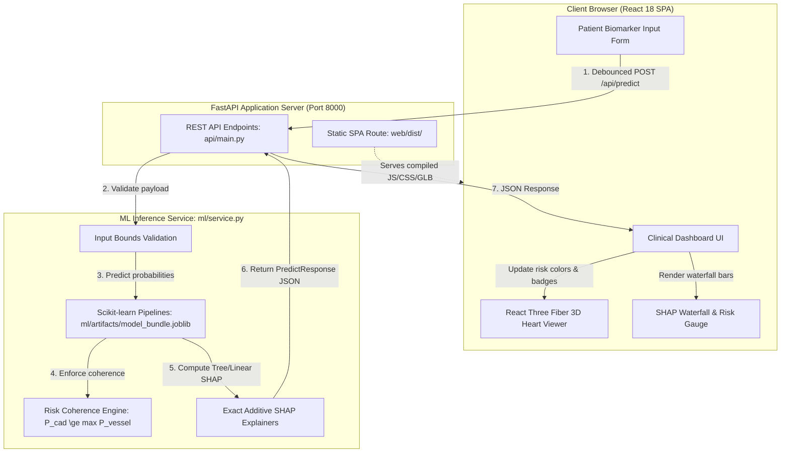
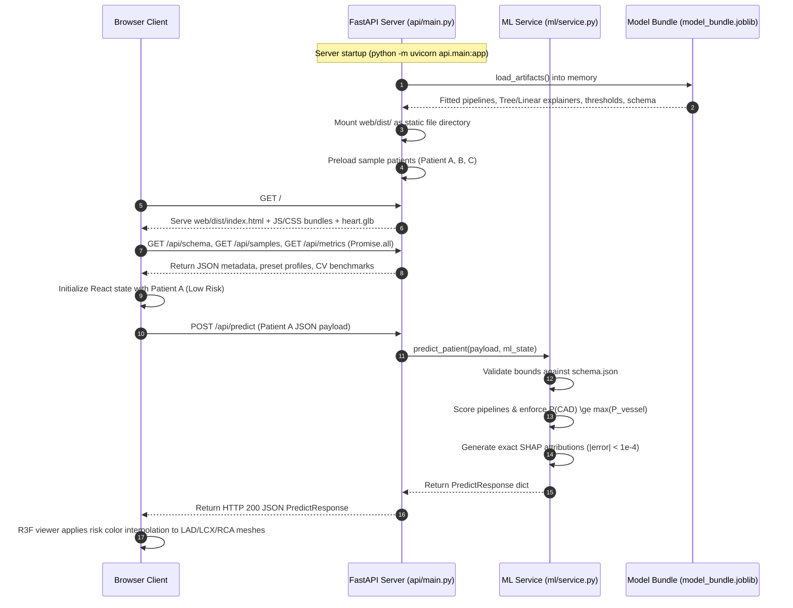

# Cardio3D AI: System Architecture & Technical Specifications

---

## 1. PROJECT OVERVIEW

### Core Purpose
**Cardio3D AI** is a clinical decision-support and educational visualization platform for coronary artery disease (CAD) risk assessment (developed for the Multimodal AI Hackathon 2026). Given 54 patient demographic, symptom, examination, ECG, echocardiographic, and laboratory biomarkers, the system concurrently predicts overall CAD status alongside vessel-specific stenosis ($\ge 50\%$ diameter reduction) across three major coronary arteries: Left Anterior Descending (**LAD**), Left Circumflex (**LCX**), and Right Coronary Artery (**RCA**). Predictions are coupled with exact additive local feature attributions via SHAP and mapped dynamically onto an interactive 3D anatomical coronary heart model derived from BodyParts3D meshes.

### Technology Stack & Pinned Direct Dependencies
The primary production stack is a unified Python FastAPI backend and a compiled React 18 Single Page Application with React Three Fiber 3D graphics:

- **Core Runtime**: Python 3.14.5 (Windows 11) / Python 3.12 (Linux/WSL2), Node.js v20+ / npm 10+
- **Machine Learning & Attribution** (pinned from `ml/requirements.txt`):
  - `scikit-learn==1.9.1`: Preprocessing pipelines, LogisticRegression, RandomForestClassifier, calibration, CV metrics
  - `xgboost==3.4.1`: Gradient-boosted decision trees for non-linear LCX stenosis prediction
  - `shap==0.52.0`: Exact `LinearExplainer` and `TreeExplainer` algorithms ($|\text{error}| < 10^{-4}$)
  - `pandas==3.0.3` & `numpy==2.5.0`: Tabular data structures, matrix operations, metric aggregation
  - `openpyxl==3.1.5`: Excel dataset ingestion
  - `joblib==1.6.0`: Pipeline and model artifact serialization
  - `scipy==1.18.1`: Statistical distributions and calibration utilities
  - `matplotlib==3.11.1`: Headless reliability and calibration plot rendering
  - `trimesh==5.1.1`: 3D OBJ parsing, coordinate centering, and binary GLB compilation
- **Application Server**:
  - `fastapi==0.139.2`: Asynchronous typed REST API framework
  - `uvicorn==0.51.0`: High-performance ASGI production server
  - `pydantic==2.12.5`: Request payload validation and schema enforcement
  - `httpx==0.28.1`: Asynchronous HTTP testing client
  - `pytest==9.1.1`: Automated unit testing framework
- **Frontend & 3D Visualization**:
  - `React 18.3.1` + `Vite 6.2.0` + `TypeScript 5.7.3`
  - `Three.js 0.170.0`, `@react-three/fiber 8.17.10`, `@react-three/drei 9.120.4`
  - `Tailwind CSS 3.4.19`, `Lucide React 0.475.0`
- **Optional Auxiliary Stack**:
  - Rust Axum + HTMX + Three.js implementation located under `extras/rust-htmx/` (see `extras/rust-htmx/README.md`).

---

## 2. DIRECTORY STRUCTURE

```text
CAD/
├── .github/workflows/ci.yml       # Ubuntu CI running Python 3.12 training & tests
├── .gitignore
├── .python-version                # Pinned Python version (3.14.5)
├── CLAUDE.md                      # Development invariants and coding guidelines
├── LICENSE                        # MIT License for software code
├── THIRD_PARTY_NOTICES.md         # BodyParts3D (CC BY-SA 2.1 JP) and UCI Dataset (CC BY 4.0)
├── Makefile                       # Setup, training, test, serve, and report targets
├── PLAN.md                        # Technical roadmap and design decisions
├── README.md                      # Project overview, quickstart, and benchmark results
├── pytest.ini                     # Pytest configuration targeting ml/tests and api/tests
│
├── api/                           # Unified FastAPI application
│   ├── main.py                    # REST API endpoints and static SPA serving
│   └── tests/                     # API integration & consistency tests
│       ├── test_api.py            # Endpoints, schema, latency, and bounds validation
│       └── test_consistency.py    # Math consistency: prob == sigmoid(raw) and SHAP additivity
│
├── data/raw/                      # Canonical immutable raw data & integrity hashes
│   ├── CHECKSUMS                  # SHA256 hashes for raw dataset and 129 OBJ meshes
│   ├── extention of Z-Alizadeh sani dataset.xlsx
│   └── BP51782_.../               # 129 BodyParts3D OBJ source meshes
│
├── docs/                          # Technical and clinical documentation
│   ├── demo_script.md             # Demonstration script
│   ├── report.md                  # Comprehensive technical report
│   └── report.pdf                 # Publication-grade PDF report (<= 6 pages)
│
├── extras/rust-htmx/              # Optional Rust Axum + HTMX stack (see extras/rust-htmx/README.md)
│
├── ml/                            # Machine learning pipeline and inference service
│   ├── artifacts/                 # Serialized models, metrics, and metadata
│   │   ├── metrics.json           # Repeated Stratified 5-Fold CV metrics
│   │   ├── model_bundle.joblib    # Serialized pipelines, explainers, and thresholds
│   │   ├── model_card.json        # Provenance, environment, and evaluation card
│   │   └── shap_global.json       # Dataset-wide global feature importance rankings
│   ├── explain.py                 # LinearSHAP & TreeSHAP exact additivity logic
│   ├── pipeline.py                # Zero-leakage data loading, column transformers
│   ├── requirements.txt           # Pinned Python package versions
│   ├── schema.json                # Authoritative metadata registry for 54 features
│   ├── service.py                 # Centralized prediction, validation, and coherence service
│   ├── train.py                   # 15-fold CV, nested threshold tuning, serialization
│   └── tests/                     # ML integrity unit tests
│       ├── test_labels.py         # Raw hash immutability & Row 93 alignment audit
│       └── test_leakage.py        # Strict zero-leakage and chance-level label shuffle test
│
├── reports/                       # Validation audits and benchmarks
│   ├── calibration_curves.png     # Reliability calibration plots across targets
│   ├── coherence_eval.md          # Quantitative audit of max() risk coherence
│   ├── data_audit.md              # Clinical feature inventory & row 93 sensitivity analysis
│   ├── fps_benchmark.json         # Automated 5-second software rendering frame-rate benchmark
│   ├── mesh_audit.md              # 3D polygon budgets and vessel extraction catalog
│   ├── model_results.md           # CV performance tables and operating thresholds
│   ├── threshold_nested.md        # Nested cross-validation per-fold threshold evaluation
│   └── screenshots/               # High-resolution dashboard and workflow captures
│
├── scripts/                       # Automation and build utilities
│   ├── build_heart_glb.py         # Assembles 129 OBJ meshes into 83,600-triangle GLB
│   ├── generate_pdf_report.py     # Compiles docs/report.pdf with ReportLab
│   └── test_ui_playwright.py      # Playwright E2E browser tests & FPS benchmark
│
└── web/                           # Primary React 18 SPA + React Three Fiber 3D viewer
    ├── index.html                 # HTML shell (zero external CDN or font links)
    ├── package.json               # Frontend dependencies and build scripts
    ├── vite.config.ts             # Bundler configuration with /api dev proxy
    ├── dist/                      # Production build bundle served by FastAPI
    └── src/                       # TypeScript/React source code
        ├── App.tsx                # Main coordinating state and tab views
        ├── types.ts               # TypeScript data models and prediction contracts
        ├── vessels.json           # Declarative coronary anatomy mapping and coordinates
        └── components/            # UI components (HeartViewer, RiskOverview, etc.)
```

---

## 3. PRIMARY SYSTEM ARCHITECTURE & DATA FLOW

The primary workstation couples a typed Python FastAPI backend with a compiled React 18 Single Page Application:



---

## 4. BOOT SEQUENCE & LIFECYCLE



---

## 5. CORE SUBSYSTEM SPECIFICATIONS

### 5.1. Machine Learning Pipeline (`ml/`)
- **Target Definitions**:
  - `Cath`: Binary coronary catheterization ($1 = \text{CAD}, 0 = \text{Normal}$).
  - `LAD`, `LCX`, `RCA`: Vessel stenosis $\ge 50\%$ diameter narrowing ($1 = \text{Stenotic}, 0 = \text{Normal}$).
- **Row 93 Rule-Based Alignment**:
  In the raw dataset, row index 93 contains `LAD='Stenotic'`, `LCX='Normal'`, `RCA='Normal'`, but `Cath='Normal'`. Because $\ge 50\%$ stenosis in any major vessel constitutes CAD, row 93 represents an internal clinical contradiction. Derived data aligns `Cath_aligned = Cath | LAD | LCX | RCA` while preserving the raw Excel file unmodified (verified via SHA256 `739343...`). This adjusts cohort labels from 216 CAD / 87 Normal to 217 CAD / 86 Normal, achieving 100% logical consistency across all 303 rows.
- **Model Selection & operating Metrics**:
  - Cath: `LogisticRegression` (CV ROC-AUC $0.929 \pm 0.024$, Operating Cutoff $0.611$, Op Sens $90.3\%$, Op Spec $82.6\%$, Nested-CV Sens $90.2\% \pm 3.9\%$).
  - LAD: `RandomForestClassifier` (CV ROC-AUC $0.846 \pm 0.049$, Operating Cutoff $0.469$, Op Sens $90.4\%$, Op Spec $60.3\%$, Nested-CV Sens $88.2\% \pm 7.2\%$).
  - LCX: `XGBClassifier` (CV ROC-AUC $0.735 \pm 0.060$, Operating Cutoff $0.217$, Op Sens $90.8\%$, Op Spec $37.0\%$, Nested-CV Sens $91.6\% \pm 6.3\%$).
  - RCA: `LogisticRegression` (CV ROC-AUC $0.733 \pm 0.045$, Operating Cutoff $0.213$, Op Sens $90.3\%$, Op Spec $39.2\%$, Nested-CV Sens $89.2\% \pm 6.9\%$).

### 5.2. Unified Prediction Service (`ml/service.py`)
Centralizes input validation, missing value imputation, inference, coherence enforcement, thresholding, and SHAP attribution into a single function `predict_patient()` shared across all entry points:
- **Bounds Validation**: Checks numeric inputs against physiological boundaries in `schema.json`.
- **Cohort Defaults**: Fills unprovided features with training medians or modes, logging all defaults applied.
- **Risk Coherence**: Retains $P(\text{CAD}) \leftarrow \max(P(\text{CAD}), \max(P_{\text{vessels}}))$, returning both `raw_prob` and `coherent_prob`.
- **SHAP Explanation**: Computes local feature attributions and sums one-hot dummies back to parent physiological features.

### 5.3. 3D Anatomical Heart Viewer (`web/src/components/HeartViewer.tsx`)
- **Asset**: Single binary GLTF/GLB (`web/public/models/heart.glb`) assembled from 129 BodyParts3D OBJ meshes located in `data/raw/`.
- **Optimization**: 49 chamber and myocardial meshes quadric-decimated to 83,600 total triangles (below $\le 100,000$ triangle budget).
- **Benchmark**: Benchmarked under pure CPU software rendering (`--disable-gpu` at 1280×720 on 13th Gen Intel Core i5-13420H): **58.4 ms mean frame time (17.1 FPS, p95 = 66.7 ms)**, recorded in `reports/fps_benchmark.json`. Renders at the display refresh rate on a GPU (not benchmarked).

---

## 6. DATA MODELS & FEATURE INVENTORY

The canonical feature registry ([ml/schema.json](file:///c:/Users/Abish/Desktop/CAD/ml/schema.json)) defines 54 active physiological features across 5 clinical categories:
- **Demographics** (5 features): `Age` (years), `Sex` (Male/Fmale), `Weight` (kg), `Length` (cm), `BMI` (kg/m²).
- **Symptoms & History** (25 features): `DM` (0/1), `HTN` (0/1), `Current Smoker` (0/1), `EX-Smoker` (0/1), `FH` (0/1), `Obesity` (Y/N), `CRF` (Y/N), `CVA` (Y/N), `Airway disease` (Y/N), `Thyroid Disease` (Y/N), `CHF` (Y/N), `DLP` (Y/N), `BP` (mmHg), `PR` (bpm), `Edema` (0/1), `Weak Peripheral Pulse` (Y/N), `Lung rales` (Y/N), `Systolic Murmur` (Y/N), `Diastolic Murmur` (Y/N), `Typical Chest Pain` (0/1), `Dyspnea` (Y/N), `Function Class` (NYHA class 0-3), `Atypical` (Y/N), `Nonanginal` (Y/N), `LowTH Ang` (Y/N).
- **ECG Features** (7 features): `Q Wave` (0/1), `St Elevation` (0/1), `St Depression` (0/1), `Tinversion` (0/1), `LVH` (Y/N), `Poor R Progression` (Y/N), `BBB` (N/LBBB/RBBB).
- **Laboratory Blood Analyses** (14 features): `FBS` (mg/dL), `CR` (mg/dL), `TG` (mg/dL), `LDL` (mg/dL), `HDL` (mg/dL), `BUN` (mg/dL), `ESR` (mm/hr), `HB` (g/dL), `K` (mEq/L), `Na` (mEq/L), `WBC` (/µL), `Lymph` (%), `Neut` (%), `PLT` (10³/µL).
- **Echocardiography** (3 features): `EF-TTE` (%), `Region RWMA` (abnormal wall motion count, 0–4), `VHD` (N/mild/Moderate/Severe).
*Total active input features*: 5 + 25 + 7 + 14 + 3 = **54**. (One column, `Exertional CP`, is constant `'N'` across all 303 rows and dropped).

### Output API Schema (`PredictResponse`)
```json
{
  "cad": {
    "prob": 0.2351,
    "raw_prob": 0.0261,
    "coherent_prob": 0.2351,
    "label": "Low Risk",
    "high_sens_label": "Low Risk",
    "threshold": 0.50,
    "high_sensitivity_threshold": 0.611,
    "nested_sensitivity": 0.9018,
    "coherence_adjusted": true
  },
  "vessels": {
    "LAD": { "prob": 0.2351, "label": "Normal", "high_sens_label": "Normal", "threshold": 0.50, "high_sensitivity_threshold": 0.469, "nested_sensitivity": 0.8816 },
    "LCX": { "prob": 0.0621, "label": "Normal", "high_sens_label": "Normal", "threshold": 0.50, "high_sensitivity_threshold": 0.217, "nested_sensitivity": 0.9159 },
    "RCA": { "prob": 0.0194, "label": "Normal", "high_sens_label": "Normal", "threshold": 0.50, "high_sensitivity_threshold": 0.213, "nested_sensitivity": 0.8922 }
  },
  "explain": {
    "Cath": { "raw_score": -3.621, "base_value": 0.932, "additive_error": 1.2e-5, "features": [...] },
    "LAD": { "raw_score": 0.2351, "base_value": 0.584, "additive_error": 3.4e-5, "features": [...] },
    "LCX": { "raw_score": -2.715, "base_value": -0.435, "additive_error": 2.1e-5, "features": [...] },
    "RCA": { "raw_score": -3.922, "base_value": -0.508, "additive_error": 1.8e-5, "features": [...] }
  },
  "cohort_defaults_applied": [],
  "disclaimer": "Decision support / educational use only — not a substitute for formal diagnostic imaging."
}
```

---

## 7. AUTOMATED VERIFICATION SUITE

The system includes strict automated test gates:
- **`ml/tests/test_labels.py`**: Verifies raw dataset SHA256 immutability, confirms raw mismatch set is uniquely row 93, and asserts $\text{Cath} = (\text{LAD} \lor \text{LCX} \lor \text{RCA})$ across all 303 rows.
- **`ml/tests/test_leakage.py`**: Asserts zero targets in feature matrix $X$, confirms all 54 features match `schema.json`, and verifies label-shuffled CV drops to chance ($0.50 \pm 0.05$).
- **`api/tests/test_api.py`**: Tests REST endpoints, schema validation, HTTP 422 on impossible physiological inputs, and p95 inference latency ($< 300$ ms).
- **`api/tests/test_consistency.py`**: Verifies exact mathematical link between probabilities and model margins ($\text{prob} == \sigma(\text{raw})$ or $\text{prob} == \text{raw}$ for RF), and asserts $|\text{base} + \sum \text{shap} - \text{raw}| < 10^{-4}$ across all presets and random dataset samples.
- **`scripts/test_ui_playwright.py`**: Headless browser automation verifying UI state updates, preset loading latency ($< 1$ s), persistent safety banners, and 5-second orbit frame-rate performance.

---

## 8. ARCHITECTURAL DECISIONS

### Why not TimesFM?
TimesFM 3.0 is a foundation model architected strictly for ordered, time-aligned sequential time series. The dataset consists of 303 independent static patient snapshots with no longitudinal temporal dimension. Imposing a pseudo-time axis over tabular clinical rows creates spurious cross-patient temporal correlations and degrades predictive validity.

### TabPFN Consideration
TabPFN was not evaluated: weights from v2.5 onward require interactive browser login tokens, impose non-commercial licensing constraints, and require specialized dependencies. The tuned tree and regularized linear pipelines achieve high discriminative power (Cath AUC 0.929, LAD AUC 0.846) with sub-millisecond local execution, deterministic outputs, and exact SHAP additivity.

### Deployment & Offline Execution
The application runs offline once built. The compiled web frontend (`web/dist/`) vendors all assets locally and uses system font stacks with zero external font or CDN network requests.
