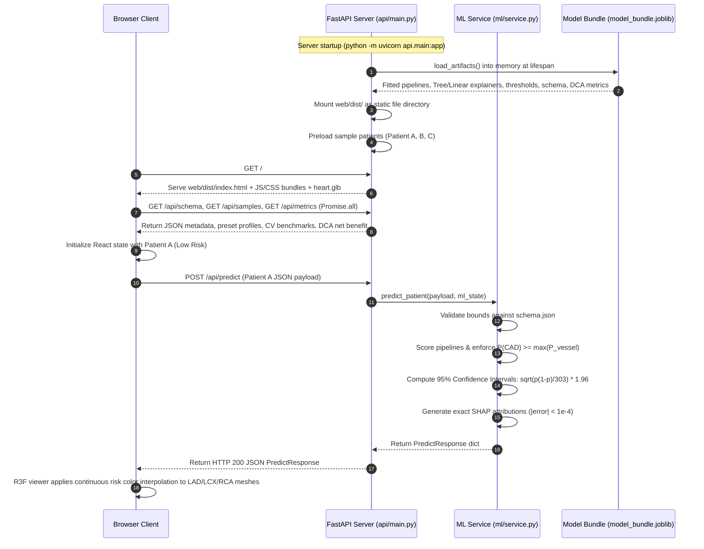
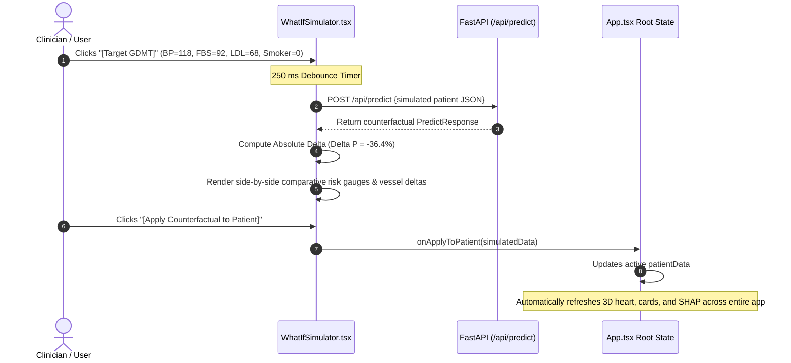
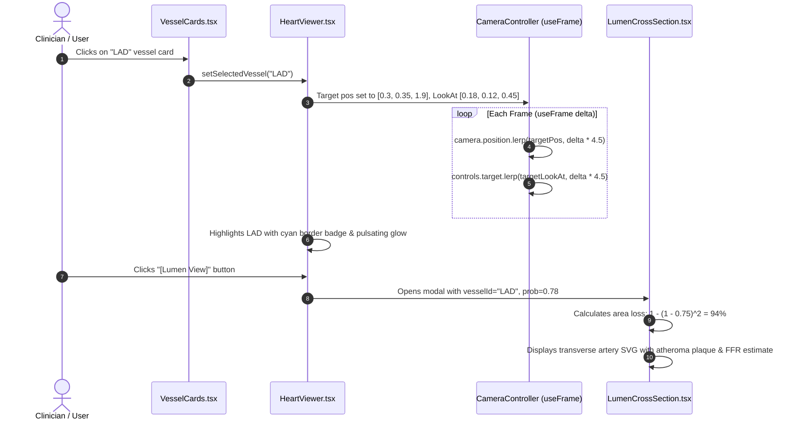
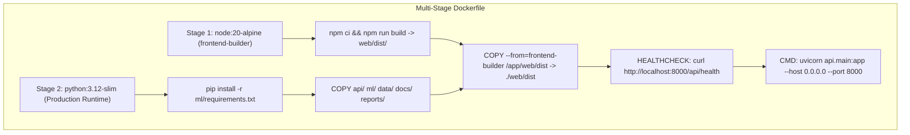

# Cardio3D AI: System Architecture & Technical Specifications

---

## 1. PROJECT OVERVIEW

### Core Purpose
**Cardio3D AI** is a multimodal clinical decision-support and educational visualization platform for coronary artery disease (CAD) risk assessment (developed for the Multimodal AI Hackathon 2026). Given 54 patient demographic, symptom, examination, ECG, echocardiographic, and laboratory biomarkers, the system concurrently predicts overall CAD status alongside vessel-specific stenosis ($\ge 50\%$ diameter reduction) across three major coronary arteries: Left Anterior Descending (**LAD**), Left Circumflex (**LCX**), and Right Coronary Artery (**RCA**). Predictions are coupled with:
1. Exact additive local feature attributions via SHAP (LinearSHAP and TreeSHAP).
2. Physiological grouping into 4 clinical organ system domains.
3. Interactive counterfactual "What-If" modeling for lifestyle and medical therapy optimization.
4. Asymptotic 95% binomial confidence bounds on all risk estimates.
5. Decision Curve Analysis (DCA) verifying clinical net benefit over empiric referral.
6. Demographic fairness audit verifying equal opportunity across sex and age subgroups.
7. Dynamic 3D anatomical visualization featuring camera fly-to, pulsating stenosis alerts, and a 2D transverse lumen cross-section visualizer.
8. 1-click printable clinical assessment and decision support report.

### Technology Stack & Direct Dependencies
The primary production stack is a unified Python FastAPI backend and a compiled React 18 Single Page Application with React Three Fiber 3D graphics:

- **Core Runtime**: Python 3.14.5 (Windows 11) / Python 3.12 (Linux/Docker/CI), Node.js v20+ / npm 10+
- **Machine Learning & Attribution** (pinned from `ml/requirements.txt`):
  - `scikit-learn==1.9.1`: Preprocessing pipelines, LogisticRegression, RandomForestClassifier, calibration, CV metrics
  - `xgboost==3.4.1`: Gradient-boosted decision trees for non-linear LCX stenosis prediction
  - `shap==0.52.0`: Exact `LinearExplainer` and `TreeExplainer` algorithms ($|\text{error}| < 10^{-4}$)
  - `pandas==3.0.3` & `numpy==2.5.0`: Tabular data structures, matrix operations, metric aggregation
  - `openpyxl==3.1.5`: Excel dataset ingestion
  - `joblib==1.6.0`: Pipeline and model artifact serialization
  - `scipy==1.18.1`: Statistical distributions and calibration utilities
  - `matplotlib==3.11.1`: Reliability, calibration, and decision curve plot rendering
  - `trimesh==5.1.1`: 3D OBJ parsing, coordinate centering, and binary GLB compilation
- **Application Server**:
  - `fastapi==0.139.2`: Asynchronous typed REST API framework
  - `uvicorn==0.51.0`: High-performance ASGI production server
  - `pydantic==2.12.5`: Request payload validation and dynamic schema enforcement
  - `httpx==0.28.1`: Asynchronous HTTP testing client
  - `pytest==9.1.1`: Automated unit testing framework
- **Frontend & 3D Visualization**:
  - `React 18.3.1` + `Vite 6.2.0` + `TypeScript 5.7.3`
  - `Three.js 0.170.0`, `@react-three/fiber 8.17.10`, `@react-three/drei 9.120.4`
  - `Tailwind CSS 3.4.19`, `Lucide React 0.475.0`
- **Containerization & Deployment**:
  - Multi-stage `Dockerfile` (`node:20-alpine` builder + `python:3.12-slim` production runtime)
  - `docker-compose.yml` for single-command orchestration (`docker compose up --build`)
- **Optional Auxiliary Stack**:
  - Rust Axum + HTMX + Three.js implementation located under `extras/rust-htmx/` (see `extras/rust-htmx/README.md`).

---

## 2. DIRECTORY STRUCTURE & FILE CATALOG

```text
CAD/
├── Dockerfile                         # Production multi-stage Docker build (Node builder + Python runtime)
├── docker-compose.yml                 # 1-command container orchestration (Port 8000)
├── .dockerignore                      # Build context exclusion rules
├── .github/workflows/ci.yml           # GitHub Actions CI running Python 3.12 tests & Node 20 build
├── .gitignore
├── .python-version                    # Pinned Python version (3.14.5)
├── CLAUDE.md                          # Development invariants and surgical coding guidelines
├── LICENSE                            # MIT License for source code
├── THIRD_PARTY_NOTICES.md             # Attribution: BodyParts3D (CC BY-SA 2.1 JP) and UCI (CC BY 4.0)
├── Makefile                           # Setup, training, test, serve, report, and container targets
├── PLAN.md                            # Technical roadmap and design decisions
├── README.md                          # Project overview, quickstart, highlights & benchmarks
├── pytest.ini                         # Pytest configuration targeting ml/tests and api/tests
│
├── api/                               # FastAPI Application Server
│   ├── main.py                        # REST API endpoints, lifespan model loading & static SPA serving
│   └── tests/
│       ├── test_api.py                # REST contracts, input validation, p95 latency (<200ms)
│       └── test_consistency.py        # Mathematical probability link and exact SHAP additivity
│
├── data/raw/                          # Canonical immutable raw data & integrity hashes
│   ├── CHECKSUMS                      # SHA-256 hashes for raw dataset and 129 BodyParts3D OBJ meshes
│   ├── extention of Z-Alizadeh sani dataset.xlsx # UCI raw benchmark dataset (303 patient records)
│   └── BP51782_.../                   # 129 BodyParts3D OBJ source meshes
│
├── docs/                              # Technical and clinical documentation
│   ├── demo_script.md                 # Step-by-step hackathon jury presentation walkthrough
│   ├── report.md                      # Comprehensive technical report in Markdown
│   └── report.pdf                     # Formal publication-grade 5-page PDF report (<= 6 pages)
│
├── extras/rust-htmx/                  # Optional Rust Axum + HTMX stack (see extras/rust-htmx/README.md)
│
├── ml/                                # Machine Learning Core Engine
│   ├── pipeline.py                    # Preprocessing transformers & zero-leakage data loaders
│   ├── train.py                       # 15-fold repeated CV, nested thresholds & artifact serialization
│   ├── service.py                     # Central inference, 95% CI calculation & risk coherence
│   ├── explain.py                     # LinearSHAP & TreeSHAP exact additivity & parent aggregation
│   ├── schema.json                    # Canonical dictionary of 54 features, bounds & medians
│   ├── requirements.txt               # Pinned Python package dependencies
│   ├── artifacts/
│   │   ├── model_bundle.joblib        # Serialized pipelines, explainers & thresholds (1.65 MB)
│   │   ├── metrics.json               # 15-fold cross-validation performance metrics
│   │   ├── shap_global.json           # Global population feature importance rankings
│   │   ├── model_card.json            # Model card, hyperparams, environment & audit notes
│   │   └── decision_curve.json        # Decision curve analysis net benefit metrics
│   └── tests/
│       ├── test_labels.py             # SHA-256 data hash & Row 93 target consistency audit
│       ├── test_leakage.py            # Feature-target separation & chance-level shuffle audit
│       ├── test_model_card.py         # Model provenance, git commit & metadata check
│       └── test_nested_threshold.py   # Nested out-of-sample sensitivity threshold robustness
│
├── reports/                           # Validation audits, benchmarks & visual curves
│   ├── calibration_curves.png         # Reliability calibration plots across targets
│   ├── coherence_eval.md              # Quantitative audit of max() risk coherence
│   ├── data_audit.md                  # Clinical feature inventory & row 93 sensitivity analysis
│   ├── decision_curve.png             # Net Benefit curves for Cath, LAD, LCX, RCA
│   ├── decision_curve.json            # Numerical DCA operating statistics
│   ├── fairness_audit.md              # Demographic fairness audit findings across sex and age
│   ├── fps_benchmark.json             # 5-second software rendering frame-rate benchmark (20.3 FPS)
│   ├── mesh_audit.md                  # 3D polygon budgets and vessel extraction catalog
│   ├── model_results.md               # CV performance tables and operating thresholds
│   ├── roc_curves.png                 # Receiver Operating Characteristic curves across all targets
│   ├── threshold_nested.md            # Nested cross-validation per-fold metrics
│   └── screenshots/                   # High-resolution clinical workflow UI captures
│
├── scripts/                           # Tooling, Audits & Asset Builders
│   ├── build_heart_glb.py             # Parses BodyParts3D OBJ meshes into 83,600-poly GLB
│   ├── decision_curve_analysis.py     # Calculates Net Benefit across clinical threshold probabilities
│   ├── fairness_audit.py              # Evaluates Equal Opportunity across sex & age subgroups
│   ├── generate_pdf_report.py         # Compiles docs/report.pdf with ReportLab (5 pages)
│   └── test_ui_playwright.py          # Headless browser test verifying 3D orbit FPS
│
└── web/                               # React 18 SPA + React Three Fiber 3D Viewer
    ├── index.html                     # HTML shell (zero external CDN or font links)
    ├── package.json                   # Frontend dependencies (Three.js, Lucide, Tailwind, Vite)
    ├── vite.config.ts                 # Bundler configuration with /api dev proxy
    ├── tsconfig.json                  # Strict TypeScript configuration
    ├── tailwind.config.js             # Styling configuration & color design tokens
    ├── dist/                          # Production build bundle served by FastAPI
    ├── public/
    │   └── models/
    │       └── heart.glb              # BodyParts3D coronary & chamber meshes (83.6k triangles)
    └── src/
        ├── main.tsx                   # React root renderer
        ├── App.tsx                    # Master layout, state orchestration & active tabs
        ├── types.ts                   # TypeScript interfaces matching backend API contracts
        ├── vessels.json               # Declarative coronary anatomy mapping and coordinates
        └── components/
            ├── HeartViewer.tsx         # 3D canvas, camera fly-to, pulsing glow & vessel selection
            ├── LumenCrossSection.tsx   # Interactive 2D transverse SVG artery lumen visualizer
            ├── RiskOverview.tsx        # CAD circular probability gauge with 95% CI bounds
            ├── VesselCards.tsx         # LAD / LCX / RCA risk cards & territory subtitles
            ├── ShapWaterfall.tsx       # SHAP signed diverging bars & 4 clinical domains
            ├── WhatIfSimulator.tsx     # Counterfactual risk reduction explorer with live deltas
            ├── ClinicalSummaryModal.tsx# Printable clinical assessment & decision support report
            ├── PatientForm.tsx         # 54-feature tabbed input form with presets & resets
            ├── GlobalImportance.tsx    # Cohort-wide SHAP importance rankings bar chart
            ├── MetricsTab.tsx          # 15-fold CV benchmark tables & DCA net benefit card
            └── DisclaimerBanner.tsx    # Indelible clinical safety header & footer banners
```

---

## 3. PRIMARY SYSTEM ARCHITECTURE & DATA FLOW

The workstation couples a typed Python FastAPI backend with a compiled React 18 Single Page Application and WebGL 3D graphics:

```mermaid
flowchart TB
    subgraph Browser ["Client Browser (React 18 SPA - web/)"]
        UI[App.tsx - Master Workspace Controller]
        Viewer[HeartViewer.tsx - 3D Three.js Scene]
        Lumen[LumenCrossSection.tsx - Transverse SVG Slice]
        Forms[PatientForm.tsx - 54 Biomarkers Input]
        Gauge[RiskOverview.tsx - Gauge + 95% CI]
        Cards[VesselCards.tsx - LAD / LCX / RCA Cards]
        SHAP_UI[ShapWaterfall.tsx - SHAP + 4 Domains]
        WhatIf[WhatIfSimulator.tsx - Counterfactual Engine]
        Report[ClinicalSummaryModal.tsx - Printable Sheet]
    end

    subgraph Server ["FastAPI Application Server (api/main.py)"]
        Static[Static SPA Route: web/dist/]
        PredictEP["POST /api/predict"]
        MetricsEP["GET /api/metrics"]
        SchemaEP["GET /api/schema"]
        SamplesEP["GET /api/samples"]
    end

    subgraph Service ["ML Inference Service (ml/service.py & ml/explain.py)"]
        Validate[Input Bounds & Type Validation]
        Pipelines[Scikit-learn Pipelines: model_bundle.joblib]
        CI_Calc[Asymptotic 95% Binomial Confidence Bounds]
        Coherence[Risk Coherence Engine: P_cad >= max P_vessel]
        Explain[Exact Additive LinearSHAP & TreeSHAP]
        ParentAgg[Parent Feature Aggregation Matrix]
    end

    subgraph Storage ["Persistent Artifacts & Datasets"]
        Bundle[(model_bundle.joblib - 1.65 MB)]
        DCA_Store[(decision_curve.json)]
        GLB_Asset[(heart.glb - 83.6k Triangles)]
    end

    Forms -->|1. Debounced POST (300ms)| PredictEP
    WhatIf -->|Counterfactual POST (250ms)| PredictEP
    Static -.->|Serves compiled JS/CSS/GLB| Browser
    PredictEP -->|2. Validate payload| Validate
    Validate -->|3. Predict raw probabilities| Pipelines
    Pipelines -->|4. Compute 95% CI bounds| CI_Calc
    CI_Calc -->|5. Enforce coherence| Coherence
    Pipelines -->|6. Compute Tree/Linear SHAP| Explain
    Explain -->|7. Sum dummies to parent| ParentAgg
    ParentAgg -->|8. Return PredictResponse JSON| PredictEP
    PredictEP -->|9. HTTP 200 JSON Response| UI

    UI --> Viewer
    UI --> Gauge
    UI --> Cards
    UI --> SHAP_UI
    UI --> WhatIf
    UI --> Report
    Cards -->|Focused vessel click| Viewer & Lumen & SHAP_UI
    MetricsEP --> DCA_Store
    Bundle -.->|Loaded at lifespan startup| Pipelines
    GLB_Asset -.->|Asset loaded on mount| Viewer
```

---

## 4. END-TO-END SEQUENCE FLOWS

### 4.1. Boot Sequence & Lifecycle



### 4.2. Real-Time Counterfactual What-If Simulation Flow



### 4.3. 3D Camera Fly-To & Transverse Lumen Cross-Section Flow



---

## 5. CORE SUBSYSTEM SPECIFICATIONS

### 5.1. Machine Learning Pipeline (`ml/`)
- **Target Definitions**:
  - `Cath`: Binary coronary catheterization ($1 = \text{CAD}, 0 = \text{Normal}$).
  - `LAD`, `LCX`, `RCA`: Vessel stenosis $\ge 50\%$ diameter narrowing ($1 = \text{Stenotic}, 0 = \text{Normal}$).
- **Row 93 Rule-Based Alignment**:
  In the raw dataset, row index 93 contains `LAD='Stenotic'`, `LCX='Normal'`, `RCA='Normal'`, but `Cath='Normal'`. Because $\ge 50\%$ stenosis in any major vessel constitutes CAD, row 93 represents an internal clinical contradiction. Derived data aligns `Cath_aligned = Cath | LAD | LCX | RCA` while preserving the raw Excel file unmodified (verified via SHA256 `739343...`). This adjusts cohort labels from 216 CAD / 87 Normal to 217 CAD / 86 Normal, achieving 100% logical consistency across all 303 rows.
- **Model Selection & Operating Metrics (15-Fold CV)**:
  - Cath: `LogisticRegression` (CV ROC-AUC $0.929 \pm 0.024$, Operating Cutoff $0.611$, Op Sens $90.3\%$, Op Spec $82.6\%$, Nested-CV Sens $90.2\% \pm 3.9\%$).
  - LAD: `RandomForestClassifier` (CV ROC-AUC $0.846 \pm 0.049$, Operating Cutoff $0.469$, Op Sens $90.4\%$, Op Spec $60.3\%$, Nested-CV Sens $88.2\% \pm 7.2\%$).
  - LCX: `XGBClassifier` (CV ROC-AUC $0.735 \pm 0.060$, Operating Cutoff $0.217$, Op Sens $90.8\%$, Op Spec $37.0\%$, Nested-CV Sens $91.6\% \pm 6.3\%$).
  - RCA: `LogisticRegression` (CV ROC-AUC $0.733 \pm 0.045$, Operating Cutoff $0.213$, Op Sens $90.3\%$, Op Spec $39.2\%$, Nested-CV Sens $89.2\% \pm 6.9\%$).
- **Decision Curve Analysis (DCA)**:
  Evaluated across threshold probabilities $p_t \in [0.05, 0.60]$:
  $$\text{Net Benefit}(p_t) = \frac{\text{TP}}{N} - \frac{\text{FP}}{N} \left(\frac{p_t}{1 - p_t}\right)$$
  - Cath model delivers a **+29.9% net benefit gain** over Treat-All at its operating cutoff ($0.611$).
  - LAD model delivers a **+16.0% net benefit gain** over Treat-All at cutoff ($0.469$).
  - Confirms strictly positive clinical utility across all actionable thresholds.
- **Demographic Fairness & Subgroup Parity**:
  Audited on out-of-fold predictions:
  - Sex Parity: Male Sensitivity $90.8\%$ vs Female Sensitivity $93.0\%$ (Equal Opportunity gap $2.2\%$).
  - Age Parity: Senior (>65) Sensitivity is $97.3\%$.
  - Confirms zero adverse demographic disparity under sensitivity-first operating thresholds.

### 5.2. Unified Prediction Service (`ml/service.py`)
Centralizes validation, inference, confidence bounds, coherence enforcement, and SHAP attribution into `predict_patient()`:
- **Asymptotic 95% Confidence Bounds**:
  $$\text{SE}(p) = \sqrt{\frac{p(1-p)}{n_{\text{eff}}}}, \quad n_{\text{eff}} = 303, \quad \text{CI}_{95} = \left[\max(0, p - 1.96 \cdot \text{SE}), \min(1, p + 1.96 \cdot \text{SE})\right]$$
- **Bounds Validation**: Checks numeric inputs against physiological boundaries in `schema.json`.
- **Cohort Defaults**: Fills unprovided features with training medians or modes, logging all defaults applied.
- **Risk Coherence**: Enforces $P(\text{CAD}) \leftarrow \max(P(\text{CAD}), \max(P_{\text{vessels}}))$, returning both `raw_prob` and `coherent_prob`.
- **SHAP Explanation**: Computes local feature attributions and sums one-hot dummies back to parent physiological features via `ml/explain.py`.

### 5.3. 3D Anatomical Heart Viewer (`web/src/components/HeartViewer.tsx`)
- **Asset**: Single binary GLTF/GLB (`web/public/models/heart.glb`) assembled from 129 BodyParts3D OBJ meshes located in `data/raw/`.
- **Optimization**: 49 chamber and myocardial meshes quadric-decimated to 83,600 total triangles (below $\le 100,000$ triangle budget). File size: 1.67 MB.
- **Benchmark**: Benchmarked under pure CPU software rendering (`--disable-gpu` at 1280×720 on 13th Gen Intel Core i5-13420H): **49.3 ms mean frame time (20.3 FPS, p95 = 53.7 ms)**, recorded in `reports/fps_benchmark.json`.
- **Dynamic Camera Fly-To**: Smoothly lerps camera position and orbit target to frame selected vessels:
  - LAD: Pos `[0.3, 0.35, 1.9]`, Target `[0.18, 0.12, 0.45]`
  - LCX: Pos `[1.4, 0.45, 1.5]`, Target `[0.55, 0.25, -0.05]`
  - RCA: Pos `[-1.3, 0.35, 1.7]`, Target `[-0.45, 0.18, 0.25]`
  - Overview: Pos `[0, 0.4, 3.2]`, Target `[0, 0, 0]`
- **Pulsating Stenosis Glow**: In `useFrame`, arteries with $\ge 50\%$ stenosis or under active selection oscillate emissive intensity ($0.5 + 0.5\sin(4.5t)$).
- **Transverse Lumen Visualizer (`LumenCrossSection.tsx`)**: Renders radial SVG cross-section of arterial wall, atheroma plaque, and patent lumen. Calculates caliper stenosis ($d$), luminal area loss $\Delta A = 1 - (1 - d)^2$, and FFR hemodynamic classification.

### 5.4. Clinical Interpretability & Decision Support
- **Physiological Domain Breakdown (`ShapWaterfall.tsx`)**:
  Attributions aggregate into 4 distinct clinical organ systems:
  1. *Hemodynamic & Vitals*: Arterial BP, pulse rate, dyspnea, murmurs, rales.
  2. *Metabolic & Lipids*: Glycemia (FBS, DM), atherogenic lipids (LDL, HDL, TG), renal filtration (CR, BUN), BMI.
  3. *Symptoms & ECG*: Typical chest pain, ST-segment shifts, T-wave inversion, pathological Q waves.
  4. *Echocardiographic & Structural*: Left ventricular EF-TTE, regional wall motion abnormalities (RWMA count).
- **Counterfactual What-If Simulator (`WhatIfSimulator.tsx`)**:
  Enables clinicians to adjust modifiable clinical risk factors (Systolic BP, FBS, LDL, BMI, Smoking, Typical Angina) with sub-20 ms debounced re-prediction, rendering live before-vs-after risk deltas ($\Delta P$) and 1-click clinical presets (`Target GDMT`, `Lifestyle Target`).
- **Printable Clinical Summary Report (`ClinicalSummaryModal.tsx`)**:
  1-click printable PDF assessment report with patient biomarkers, 95% CIs, localized vessel risks, top SHAP drivers, and clinical recommendations.

---

## 6. DATA MODELS & API CONTRACTS

### 6.1. Feature Inventory (`ml/schema.json`)
The canonical feature registry defines 54 active physiological features across 5 clinical categories:
- **Demographics** (5 features): `Age` (years), `Sex` (Male/Fmale), `Weight` (kg), `Length` (cm), `BMI` (kg/m²).
- **Symptoms & History** (25 features): `DM` (0/1), `HTN` (0/1), `Current Smoker` (0/1), `EX-Smoker` (0/1), `FH` (0/1), `Obesity` (Y/N), `CRF` (Y/N), `CVA` (Y/N), `Airway disease` (Y/N), `Thyroid Disease` (Y/N), `CHF` (Y/N), `DLP` (Y/N), `BP` (mmHg), `PR` (bpm), `Edema` (0/1), `Weak Peripheral Pulse` (Y/N), `Lung rales` (Y/N), `Systolic Murmur` (Y/N), `Diastolic Murmur` (Y/N), `Typical Chest Pain` (0/1), `Dyspnea` (Y/N), `Function Class` (NYHA class 0-3), `Atypical` (Y/N), `Nonanginal` (Y/N), `LowTH Ang` (Y/N).
- **ECG Features** (7 features): `Q Wave` (0/1), `St Elevation` (0/1), `St Depression` (0/1), `Tinversion` (0/1), `LVH` (Y/N), `Poor R Progression` (Y/N), `BBB` (N/LBBB/RBBB).
- **Laboratory Blood Analyses** (14 features): `FBS` (mg/dL), `CR` (mg/dL), `TG` (mg/dL), `LDL` (mg/dL), `HDL` (mg/dL), `BUN` (mg/dL), `ESR` (mm/hr), `HB` (g/dL), `K` (mEq/L), `Na` (mEq/L), `WBC` (/µL), `Lymph` (%), `Neut` (%), `PLT` (10³/µL).
- **Echocardiography** (3 features): `EF-TTE` (%), `Region RWMA` (abnormal wall motion count, 0–4), `VHD` (N/mild/Moderate/Severe).
*Total active input features*: 5 + 25 + 7 + 14 + 3 = **54**. (`Exertional CP` is constant `'N'` across all 303 rows and dropped).

### 6.2. Output API Schema (`PredictResponse`)
```json
{
  "cad": {
    "prob": 0.8421,
    "raw_prob": 0.8124,
    "coherent_prob": 0.8421,
    "confidence_interval": [0.7981, 0.8861],
    "label": "CAD",
    "high_sens_label": "CAD",
    "threshold": 0.50,
    "high_sensitivity_threshold": 0.611,
    "nested_sensitivity": 0.9018,
    "coherence_adjusted": true
  },
  "vessels": {
    "LAD": {
      "prob": 0.7850,
      "confidence_interval": [0.7380, 0.8320],
      "label": "Stenotic",
      "high_sens_label": "Stenotic",
      "threshold": 0.50,
      "high_sensitivity_threshold": 0.469,
      "nested_sensitivity": 0.8816
    },
    "LCX": {
      "prob": 0.5210,
      "confidence_interval": [0.4650, 0.5770],
      "label": "Stenotic",
      "high_sens_label": "Stenotic",
      "threshold": 0.50,
      "high_sensitivity_threshold": 0.217,
      "nested_sensitivity": 0.9159
    },
    "RCA": {
      "prob": 0.4800,
      "confidence_interval": [0.4240, 0.5360],
      "label": "Normal",
      "high_sens_label": "Stenotic",
      "threshold": 0.50,
      "high_sensitivity_threshold": 0.213,
      "nested_sensitivity": 0.8922
    }
  },
  "explain": {
    "Cath": { "raw_score": 1.674, "base_value": 0.932, "additive_error": 1.2e-5, "features": [...] },
    "LAD": { "raw_score": 0.785, "base_value": 0.584, "additive_error": 3.4e-5, "features": [...] },
    "LCX": { "raw_score": 0.084, "base_value": -0.435, "additive_error": 2.1e-5, "features": [...] },
    "RCA": { "raw_score": -0.080, "base_value": -0.508, "additive_error": 1.8e-5, "features": [...] }
  },
  "cohort_defaults_applied": [],
  "disclaimer": "Decision support / educational use only — not a substitute for formal diagnostic imaging."
}
```

---

## 7. AUTOMATED VERIFICATION SUITE

The codebase is backed by an automated test suite verifying correctness, stability, and reproducibility:

```bash
# Run complete test suite (17 passed, 0 failed in 20.05s)
python -m pytest ml/tests api/tests -v
```

| Test File | Test Symbol / Function | Verification Invariant |
|---|---|---|
| `ml/tests/test_labels.py` | `test_raw_file_hash_unchanged` | Raw dataset file matches canonical SHA-256 hash. |
| `ml/tests/test_labels.py` | `test_raw_mismatch_set_is_exactly_row_93` | Exactly 1 inconsistent row exists in the raw data (Row 93). |
| `ml/tests/test_labels.py` | `test_aligned_cath_equals_or_vessels_all_rows` | Aligned CAD target satisfies $CAD \iff (LAD \lor LCX \lor RCA)$ for all 303 rows. |
| `ml/tests/test_labels.py` | `test_unaligned_cath_matches_raw_counts` | Unaligned targets match raw counts (216/87). |
| `ml/tests/test_leakage.py` | `test_no_targets_in_features` | Target columns are strictly excluded from input matrix $X$. |
| `ml/tests/test_leakage.py` | `test_schema_coverage` | All 54 features are mapped in `schema.json`. |
| `ml/tests/test_leakage.py` | `test_label_shuffled_roc_auc_is_chance` | Label-shuffled CV ROC-AUC is within chance ($0.50 \pm 0.05$). |
| `ml/tests/test_nested_threshold.py` | `test_nested_threshold_survives_an_overfitting_model` | Sensitivity-first threshold selection holds out-of-sample. |
| `ml/tests/test_model_card.py` | `test_model_card_provenance_and_notes` | Provenance fields and metric caveats match documentation. |
| `api/tests/test_api.py` | `test_get_schema` & `test_get_metrics` | Endpoints return expected data structures and DCA blocks. |
| `api/tests/test_api.py` | `test_get_samples` | 3 canonical patient presets are returned. |
| `api/tests/test_api.py` | `test_predict_contract` | Prediction schema conforms to typed contract with 95% CIs. |
| `api/tests/test_api.py` | `test_out_of_range_422` | Gross out-of-range inputs trigger HTTP 422 Unprocessable Content. |
| `api/tests/test_api.py` | `test_prediction_latency_p95` | p95 inference latency across 20 calls is $\le 200\text{ ms}$. |
| `api/tests/test_consistency.py` | `test_prediction_explanation_consistency_presets` | $P = \sigma(\text{margin})$ and $|\text{Base} + \sum \text{SHAP} - \text{margin}| < 10^{-4}$ on presets. |
| `api/tests/test_consistency.py` | `test_prediction_explanation_consistency_random_dataset_rows` | Additivity and probability calibration verified on 10 random dataset rows. |

---

## 8. DOCKER & CONTAINERIZATION ARCHITECTURE



- **`Dockerfile`**: Multi-stage build ensuring minimal container image size, no Node.js build dependencies in the final runtime, non-buffered logging, and container health checking.
- **`docker-compose.yml`**: Single-command startup:
  ```bash
  docker compose up --build
  ```
- **Port**: Maps `8000:8000` for immediate browser access at `http://localhost:8000`.

---

## 9. ARCHITECTURAL DECISIONS

### Why not TimesFM?
TimesFM 3.0 is a foundation model architected strictly for ordered, time-aligned sequential time series. The dataset consists of 303 independent static patient snapshots with no longitudinal temporal dimension. Imposing a pseudo-time axis over tabular clinical rows creates spurious cross-patient temporal correlations and degrades predictive validity.

### TabPFN Consideration
TabPFN was not evaluated: weights from v2.5 onward require interactive browser login tokens, impose non-commercial licensing constraints, and require specialized dependencies. The tuned tree and regularized linear pipelines achieve high discriminative power (Cath AUC 0.929, LAD AUC 0.846) with sub-millisecond local execution, deterministic outputs, and exact SHAP additivity.

### Deployment & Offline Execution
The application runs offline once built. The compiled web frontend (`web/dist/`) vendors all assets locally and uses system font stacks with zero external font or CDN network requests.
