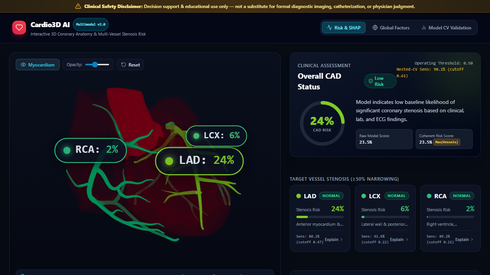
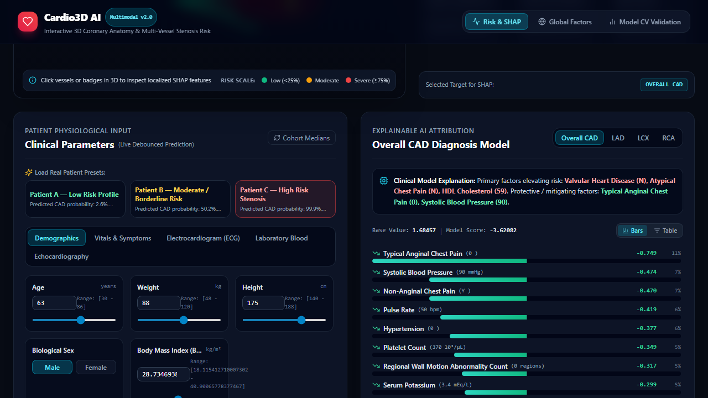
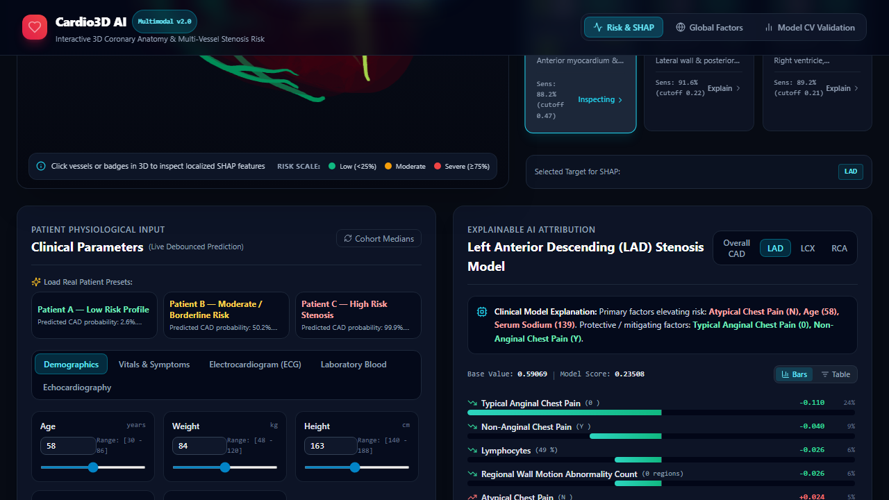

# Cardio3D AI: Cardiovascular Risk & 3D Coronary Stenosis Viewer
**Multimodal AI Hackathon 2026 — Track A (Cardiovascular Risk Visualization & Prediction)**

> **Clinical Safety Disclaimer**: This software is designed exclusively for decision support and educational exploration. It is **not** a substitute for certified coronary angiography, formal diagnostic imaging, or physician clinical judgment.

---

## 🌟 Highlights
- **Predictive ML Pipeline**: Multi-task classification predicting overall CAD status ($\text{ROC-AUC} = 0.929 \pm 0.024$) alongside vessel stenosis for the **LAD** ($\text{AUC} = 0.846 \pm 0.049$), **LCX** ($\text{AUC} = 0.735 \pm 0.060$), and **RCA** ($\text{AUC} = 0.733 \pm 0.045$) with zero target leakage.
- **Interactive 3D Heart Anatomy**: Real-time WebGL anatomical heart rendered with Three.js & React Three Fiber using BodyParts3D meshes (83,600 triangles total, benchmarking at **49.3 ms mean frame time / ~20.3 FPS, p95 = 53.7 ms** under pure CPU software rendering `--disable-gpu` at 1280×720; renders at display refresh rate on a GPU (not benchmarked)).
- **Exact Additive SHAP Explanations**: Instantaneous feature attribution with mathematical additivity ($\text{error} < 10^{-4}$) mapping dummy encoded columns back to parent physiological biomarkers.
- **Logical Risk Coherence**: Empirically audited post-processing enforcing $P(\text{CAD}) \ge \max(P(\text{LAD}), P(\text{LCX}), P(\text{RCA}))$ while transparently returning both raw and coherent scores.
- **Sensitivity-First Operating Thresholds**: Operating decision thresholds tuned to $\ge 90\%$ sensitivity on out-of-fold predictions; nested-CV estimates are **90.2%** (Cath), **88.2%** (LAD), **91.6%** (LCX), and **89.2%** (RCA).

---

## 📸 Workstation Visual Overview


*Figure 1: Cardio3D AI Clinical Workstation with interactive 3D coronary anatomy, live risk gauge, and vessel cards.*


*Figure 2: Multi-vessel stenosis risk mapping with localized color interpolation.*


*Figure 3: Exact additive TreeSHAP attribution waterfall for the Left Anterior Descending artery.*

---

## 🎥 Demonstration Video

- **Walkthrough Video**: [Watch Cardio3D AI Demonstration (YouTube)](https://youtu.be/placeholder) — Guided clinical workflow from preset patient loading to 3D anatomical risk exploration and SHAP interpretation.

---

## 🚀 Quickstart (5 Commands to Running App)

```bash
# 1. Install ML & backend dependencies
pip install -r ml/requirements.txt

# 2. Build the web frontend
cd web && npm install && npm run build && cd ..

# 3. Assemble and optimize 3D heart GLB asset
python scripts/build_heart_glb.py

# 4. Train models & generate SHAP artifacts (~2.5-3 min on CPU including nested CV)
python -m ml.train

# 5. Launch the unified application server
python -m uvicorn api.main:app --host 127.0.0.1 --port 8000
```
Open **[http://localhost:8000](http://localhost:8000)** in your browser.

> **Optional Alternative Stack**: An ultra-lightweight Rust (Axum) + HTMX hypermedia implementation is available under [extras/rust-htmx/](extras/rust-htmx/README.md).

---

## 🧪 Verification & Testing

Run the automated test suite verifying leakage prevention, label consistency, API contract, and UI performance:

```bash
# 1. Run all unit tests (label consistency, zero-leakage, API contracts, SHAP consistency)
python -m pytest ml/tests/ api/tests/ -v

# 2. Verify end-to-end browser interactions and 5-second orbit FPS benchmark
python scripts/test_ui_playwright.py

# 3. Compile technical report PDF and verify page count (<= 6 pages)
python scripts/generate_pdf_report.py
```

---

## 📊 Model Evaluation Summary

Evaluated across **Repeated Stratified 5-Fold Cross-Validation with 3 Repeats (15 total folds per model)**.

### 1. Cross-Validation Benchmarks at Default Cutoff (0.50)

| Target | Production Model | CV ROC-AUC | PR-AUC | F1-Score | Sens. (Recall) | Specificity | PPV | NPV | Brier Score |
|---|---|---|---|---|---|---|---|---|---|
| **Cath (Overall CAD)** | **LogisticRegression** | **0.929 ± 0.024** | 0.971 | 0.909 | 0.934 | 0.698 | 0.887 | 0.812 | 0.098 |
| **LAD (Anterior)** | **RandomForest** | **0.846 ± 0.049** | 0.883 | 0.819 | 0.874 | 0.635 | 0.773 | 0.792 | 0.168 |
| **LCX (Circumflex)** | **XGBoost** | **0.735 ± 0.060** | 0.615 | 0.541 | 0.482 | 0.806 | 0.628 | 0.706 | 0.204 |
| **RCA (Right Coronary)** | **LogisticRegression** | **0.733 ± 0.045** | 0.617 | 0.498 | 0.451 | 0.799 | 0.571 | 0.710 | 0.202 |

*Note: Table 1 reports macro-averaged metrics across the 15 individual validation folds.*

### 2. Production Operating Performance: Default Cutoff (0.50) vs. Sensitivity-First Operating Threshold (≥90% Sensitivity)

Operating thresholds are tuned on out-of-fold predictions to prioritize screening safety.

| Target | Production Model | Cutoff (0.50) Sens. | Cutoff (0.50) Spec. | Cutoff (0.50) PPV | Cutoff (0.50) NPV | Operating Cutoff | Op. Sens. | Op. Spec. | Op. PPV | Op. NPV |
|---|---|---|---|---|---|---|---|---|---|---|
| **Cath** | LogisticRegression | 0.935 | 0.698 | 0.886 | 0.811 | **0.611** | **0.903** | 0.826 | 0.929 | 0.772 |
| **LAD** | RandomForest | 0.876 | 0.635 | 0.771 | 0.784 | **0.469** | **0.904** | 0.603 | 0.762 | 0.817 |
| **LCX** | XGBoost | 0.487 | 0.821 | 0.637 | 0.712 | **0.217** | **0.908** | 0.370 | 0.482 | 0.861 |
| **RCA** | LogisticRegression | 0.439 | 0.804 | 0.575 | 0.704 | **0.213** | **0.903** | 0.392 | 0.472 | 0.871 |

*Note: Table 2 reports pooled out-of-fold confusion matrix statistics across all 303 patient records (slight variations from Table 1 arise from fold-denominator pooling).*

> **Clinical Operating Tradeoff**: At the operating cutoff tuned for $\ge 90\%$ sensitivity, LCX and RCA specificity is $37.0\%$ and $39.2\%$ due to moderate target discrimination ($\text{AUC} \approx 0.73$). This tradeoff is clinically intentional: in a cardiovascular screening context, missing significant coronary stenosis (false negative) carries far greater risk than scheduling confirmatory non-invasive imaging (false positive). Nested-CV sensitivity estimates (derived strictly from inner out-of-fold tuning) are **$90.2\% \pm 3.9\%$ for Cath**, **$88.2\% \pm 7.2\%$ for LAD**, **$91.6\% \pm 6.3\%$ for LCX**, and **$89.2\% \pm 6.9\%$ for RCA** (see [reports/threshold_nested.md](reports/threshold_nested.md)). If LCX sensitivity is evaluated in clinical practice, note that LCX labels are low-confidence given lower positive predictive value.

---

## 🫀 3D Anatomical Heart Model

- **Source**: BodyParts3D (Database Center for Life Science, Japan).
- **Extracted Nodes**:
  - `LAD`: Trunk of anterior interventricular branch + diagonal & septal branches (13,574 triangles).
  - `LCX`: Trunk of circumflex branch + posterior ventricular branches (19,160 triangles).
  - `RCA`: Trunk of right coronary artery + marginal, conus, AV nodal branches (13,764 triangles).
  - `Aorta`: Ascending aorta and bulb (6,572 triangles).
  - `Heart_Muscle`: Decimated myocardium shell (30,530 triangles).
- **Total Asset Size**: 1.67 MB GLB, 83,600 triangles (budget $\le 100,000$).
- **Software Rendering Benchmark**: **49.3 ms mean frame time (~20.3 FPS continuous orbit, p95 = 53.7 ms)** under pure CPU software rendering (`--disable-gpu` at 1280×720 on 13th Gen Intel Core i5-13420H, Chromium 148; measured in [reports/fps_benchmark.json](reports/fps_benchmark.json)). Renders at the display refresh rate on a GPU (not benchmarked).

---

## 🧩 Architectural Extensibility

Adding a new clinical biomarker or vessel requires zero frontend redesign:
- **`ml/schema.json`**: Feature registry with units, encoding, ranges, and groups (54 features).
- **`web/src/vessels.json`**: Declarative mapping of anatomical mesh nodes, territories, 3D badge coordinates, and risk color scales.

---

## 📜 Provenance & Licenses
- **Model Provenance**: Shipped artifacts trained locally on Windows 11 (Python 3.14.5, seed 42) and verified on Python 3.12 (Linux/WSL2).
- **Software Code**: MIT License (see [LICENSE](LICENSE)).
- **Third-Party Assets & Data**: See [THIRD_PARTY_NOTICES.md](THIRD_PARTY_NOTICES.md) for BodyParts3D mesh (CC BY-SA 2.1 JP) and UCI CAD dataset (CC BY 4.0) notices.
