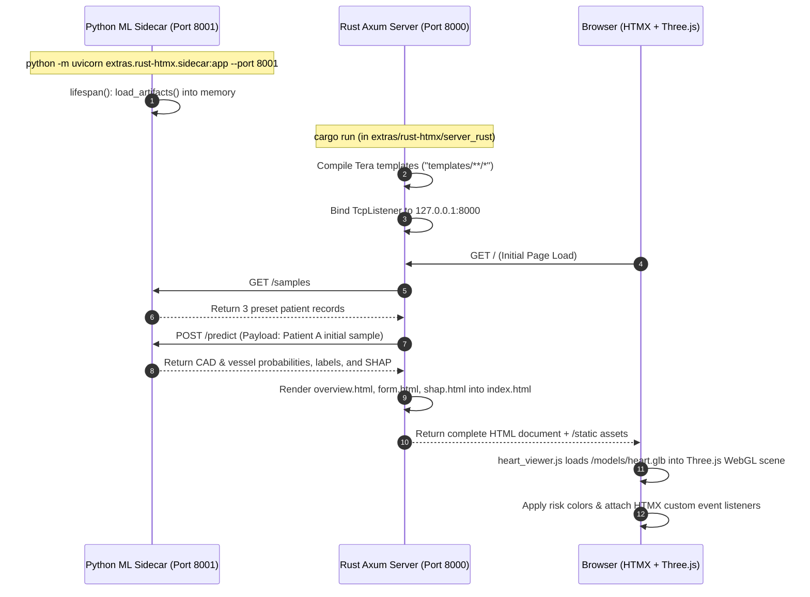

# Optional Stack: Rust (Axum) + HTMX + Three.js Medical Workstation

This directory contains an optional, ultra-lightweight alternative architecture for Cardio3D AI built with **Rust (Axum)**, **HTMX 2.0**, **Vanilla Three.js**, and a **Python ML Sidecar**.

---

## 1. Architectural Overview



---

## 2. Directory Inventory

```text
extras/rust-htmx/
├── README.md                     # This documentation file
├── sidecar.py                    # Lightweight Python FastAPI sidecar on port 8001
├── test_rust_ui_playwright.py    # Playwright browser verification for Rust + HTMX
├── screenshots/                  # High-resolution screenshots of the Rust UI
└── server_rust/                  # Rust Axum project
    ├── Cargo.toml                # Axum, Tokio, Tower, Tera, Reqwest dependencies
    ├── Cargo.lock
    ├── src/main.rs               # Axum server routes, Tera rendering, IPC handlers
    ├── templates/                # Tera HTML partial templates
    │   ├── index.html            # Main dashboard shell with persistent disclaimer
    │   ├── overview.html         # CAD gauge & LAD/LCX/RCA vessel risk cards
    │   ├── form.html             # Dynamic 54-biomarker input form with preset buttons
    │   ├── shap.html             # Top-8 SHAP local feature attribution waterfall
    │   ├── global_factors.html   # Cohort-wide global feature importance ranking
    │   └── cv_metrics.html       # 15-fold cross-validation performance table
    └── static/
        ├── css/style.css         # Dark glassmorphic medical workstation styling
        ├── js/heart_viewer.js    # Vanilla Three.js 3D viewer & color-mapping engine
        └── models/heart.glb      # 83,600-triangle 3D anatomical GLB model
```

---

## 3. Running the Rust + HTMX Stack

```bash
# Terminal 1: Launch Python ML sidecar (port 8001)
python -m uvicorn extras.rust-htmx.sidecar:app --host 127.0.0.1 --port 8001

# Terminal 2: Launch Rust Axum server (port 8000)
cd extras/rust-htmx/server_rust
cargo run --release
```

Open **[http://127.0.0.1:8000](http://127.0.0.1:8000)** in your browser.

---

## 4. Key Endpoints & IPC Contracts

- `GET /`: Renders initial dashboard with Patient A defaults pre-populated.
- `POST /predict`: Receives form submissions, queries `http://127.0.0.1:8001/predict` (which imports `predict_patient()` from `ml/service.py`), and returns multi-swap HTML partials (`#overview-container` and `#shap-container`).
- `GET /api/sample/:id`: Fetches preset patient data (`sample-low-risk`, `sample-mid-risk`, `sample-high-risk`), updates input fields, and triggers HTMX recalculation.
- `GET /tab/global-factors`: Renders cohort-wide global SHAP ranking partial.
- `GET /tab/cv-metrics`: Renders 15-fold CV metrics table partial.
